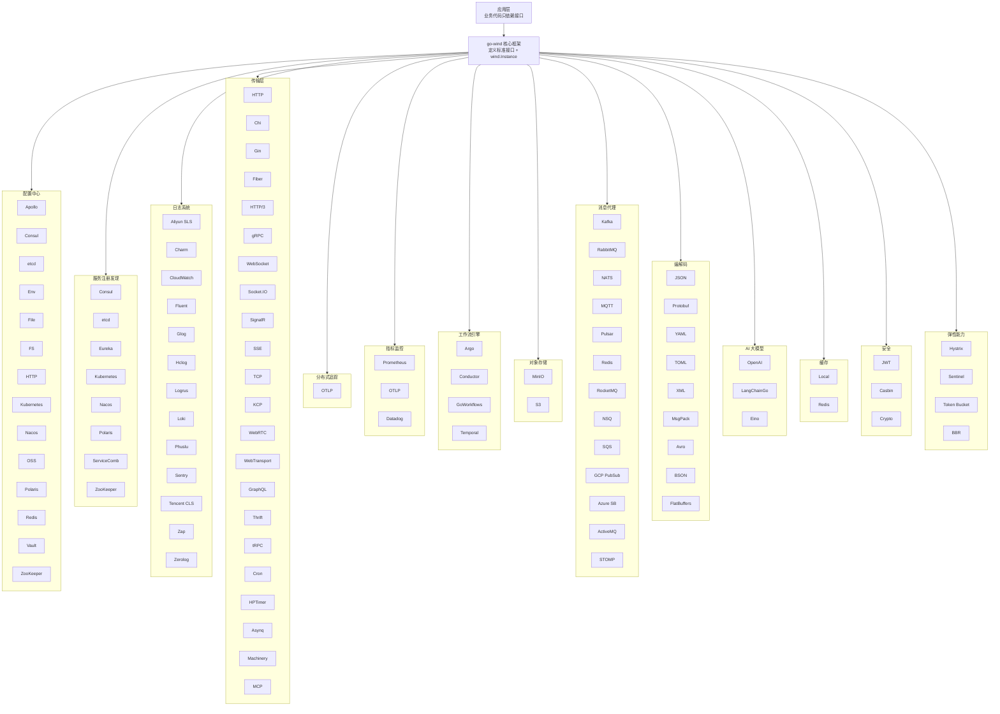

<p align="center">
  <h1 align="center">Go Wind Plugins · 风行插件库</h1>
  <p align="center">
    Go Wind 微服务框架的多引擎插件生态
  </p>
  <p align="center">
    <em>一套接口，多种引擎，按需组装，即插即用</em>
  </p>
</p>

<p align="center">
  <a href="README.md">中文</a> · <a href="README_en.md">English</a> · <a href="README_ja.md">日本語</a>
</p>

<p align="center">
  
  
  
  
</p>

---

## 项目简介

**go-wind-plugins** 是 [go-wind](https://github.com/tx7do/go-wind) 微服务框架的官方插件库，为配置中心、服务注册发现、日志系统和传输层提供统一的抽象接口与多引擎适配实现。

采用**乐高式组合设计**——每个插件只实现核心框架定义的标准接口，你可以根据实际技术栈自由选择底层引擎，切换引擎时无需改动业务代码。

---

## 项目亮点

- **统一接口**：八大领域（Config / Registry / Log / Metrics / Transport / Broker / Encoding / Tracer）均由核心框架定义标准接口，插件只做实现
- **多引擎支持**：12 种配置中心、8 种注册中心、14 种日志后端、3 种指标后端、4 种 HTTP 驱动、20+ 种传输层协议、12 种消息代理、11 种编解码、3 种 AI SDK、1 种 OTLP 追踪协议，覆盖主流技术栈
- **零侵入**：业务代码只依赖接口，不依赖具体引擎 SDK
- **独立版本**：每个子模块独立 `go.mod`，按需引入，避免依赖膨胀
- **Workspace 协同**：通过 `go.work` 管理多模块，开发体验如单仓项目

---

## 核心接口

### 配置中心（Config）

| 接口 | 方法 | 说明 |
|------|------|------|
| `Reader` | `Load(ctx, key) ([]byte, error)` | 按 key 一次性加载配置 |
| `Watcher` | `Watch(ctx, key) (<-chan struct{}, error)` | 信号模式，值变更时通知 |
| `ValueWatcher` | `WatchValue(ctx, key) (<-chan []byte, error)` | 推值模式，直接推送新值 |
| `Closer` | `Close() error` | 资源释放 |
| `Decoder` | `Decode(data, out) error` | 原始字节反序列化 |

### 服务注册发现（Registry）

| 接口 | 方法 | 说明 |
|------|------|------|
| `Registrar` | `Register(ctx, *Instance)` / `Deregister(ctx, *Instance)` | 服务注册与注销 |
| `Discovery` | `GetService(ctx, name)` / `Watch(ctx, name)` | 服务发现与监听 |
| `Watcher` | `Next(ctx) ([]*Instance, error)` / `Stop()` | 实例变更流 |

### 日志（Log）

| 接口 | 方法 | 说明 |
|------|------|------|
| `Logger` | `Debug/Info/Warn/Error(ctx, msg, keyvals...)` | 四级日志输出 |
| `Logger` | `With(keyvals...) Logger` | 附加上下文字段 |
| `Logger` | `Enabled(Level) bool` | 级别判断 |

### 传输层（Transport）

| 接口 | 方法 | 说明 |
|------|------|------|
| `Server` (HTTP) | `Handle / GET / POST / PUT / DELETE...` | 路由注册 |
| `Server` (HTTP) | `Start(ctx)` / `Stop(ctx)` / `Endpoint()` | 生命周期管理 |
| `Driver` (HTTP) | `Handle / Start / Stop` | 框架适配驱动 |

### 分布式追踪（Tracer）

> 基于 OpenTelemetry 标准，不定义自定义接口，直接使用原生 OTel 类型。

| 类型 | 方法 | 说明 |
|------|------|------|
| `*sdktrace.TracerProvider` | `Tracer(name) trace.Tracer` | 创建标准 OTel Tracer |
| `*sdktrace.TracerProvider` | `Shutdown(ctx)` | 关闭 provider，刷新未导出 span |
| `trace.Tracer` | `Start(ctx, name, opts...)` | 创建 Span，注入 trace 上下文 |

### 消息代理（Broker）

| 接口 | 方法 | 说明 |
|------|------|------|
| `Broker` | `Name() string` | 获取 Broker 名称 |
| `Broker` | `Address() string` | 获取 Broker 地址 |
| `Broker` | `Init(...Option) error` | 初始化 Broker |
| `Broker` | `Connect() / Disconnect() error` | 连接 / 断开 Broker |
| `Broker` | `Publish(ctx, topic, *Message, ...PublishOption) error` | 发布消息到主题 |
| `Broker` | `Subscribe(topic, Handler, Binder, ...SubscribeOption) (Subscriber, error)` | 订阅主题 |
| `Broker` | `Request(ctx, topic, *Message, ...RequestOption) (*Message, error)` | 请求-响应模式 |
| `Message` | `Headers / Body / Key` | 消息头、消息体、分区键 |
| `Event` | `Topic() / Message() / Ack() / Error()` | 订阅者收到的事件 |
| `Subscriber` | `Unsubscribe() error` | 取消订阅 |

### 指标监控（Metrics）

| 接口 | 方法 | 说明 |
|------|------|------|
| `Metrics` | `Counter(ctx, name, value, labels)` | 单调递增计数器（请求数、错误数） |
| `Metrics` | `Histogram(ctx, name, value, labels)` | 直方图分布（延迟、负载大小） |
| `Metrics` | `Gauge(ctx, name, value, labels)` | 当前瞬时值（队列深度、活跃连接数） |
| `Closer` | `Close() error` | 关闭并刷新未发送数据 |

### 编解码（Encoding）

| 接口/函数 | 方法 | 说明 |
|------|------|------|
| `Codec` | `Marshal(v) ([]byte, error)` | 序列化 |
| `Codec` | `Unmarshal(data, v) error` | 反序列化 |
| `Codec` | `Name() string` | 编解码器名称（json/proto/yaml） |
| 包函数 | `RegisterCodec(c)` / `GetCodec(name)` | 全局注册表 |

---

## 插件矩阵

### 配置中心（Config）

| 插件 | 模块路径 | 引擎 |
|------|---------|------|
| Apollo | `github.com/tx7do/go-wind-plugins/config/apollo` | 携程 Apollo |
| Consul | `github.com/tx7do/go-wind-plugins/config/consul` | HashiCorp Consul KV |
| Etcd | `github.com/tx7do/go-wind-plugins/config/etcd` | CoreOS etcd |
| Env | `github.com/tx7do/go-wind-plugins/config/env` | 环境变量 |
| File | `github.com/tx7do/go-wind-plugins/config/file` | 本地文件 |
| FS | `github.com/tx7do/go-wind-plugins/config/fs` | fs.FS |
| HTTP | `github.com/tx7do/go-wind-plugins/config/http` | HTTP 远程拉取 |
| Kubernetes | `github.com/tx7do/go-wind-plugins/config/kubernetes` | K8s ConfigMap / Secret |
| Nacos | `github.com/tx7do/go-wind-plugins/config/nacos` | 阿里云 Nacos |
| OSS | `github.com/tx7do/go-wind-plugins/config/oss` | 对象存储 |
| Polaris | `github.com/tx7do/go-wind-plugins/config/polaris` | 腾讯云 Polaris |
| Redis | `github.com/tx7do/go-wind-plugins/config/redis` | Redis KV |
| Vault | `github.com/tx7do/go-wind-plugins/config/vault` | HashiCorp Vault |
| Zookeeper | `github.com/tx7do/go-wind-plugins/config/zookeeper` | Apache ZooKeeper |

### 服务注册发现（Registry）

| 插件 | 模块路径 | 引擎 |
|------|---------|------|
| Consul | `github.com/tx7do/go-wind-plugins/registry/consul` | HashiCorp Consul |
| Etcd | `github.com/tx7do/go-wind-plugins/registry/etcd` | CoreOS etcd |
| Eureka | `github.com/tx7do/go-wind-plugins/registry/eureka` | Netflix Eureka |
| Kubernetes | `github.com/tx7do/go-wind-plugins/registry/kubernetes` | K8s Endpoints |
| Nacos | `github.com/tx7do/go-wind-plugins/registry/nacos` | 阿里云 Nacos |
| Polaris | `github.com/tx7do/go-wind-plugins/registry/polaris` | 腾讯云 Polaris |
| ServiceComb | `github.com/tx7do/go-wind-plugins/registry/servicecomb` | Apache ServiceComb |
| Zookeeper | `github.com/tx7do/go-wind-plugins/registry/zookeeper` | Apache ZooKeeper |

### 日志（Log）

| 插件 | 模块路径 | 引擎 |
|------|---------|------|
| Aliyun SLS | `github.com/tx7do/go-wind-plugins/log/aliyun` | 阿里云日志服务 SLS |
| Charm | `github.com/tx7do/go-wind-plugins/log/charm` | charmbracelet/log |
| CloudWatch | `github.com/tx7do/go-wind-plugins/log/cloudwatch` | AWS CloudWatch Logs |
| Fluent | `github.com/tx7do/go-wind-plugins/log/fluent` | Fluentd |
| Glog | `github.com/tx7do/go-wind-plugins/log/glog` | golang/glog |
| Hclog | `github.com/tx7do/go-wind-plugins/log/hclog` | hashicorp/go-hclog |
| Logrus | `github.com/tx7do/go-wind-plugins/log/logrus` | sirupsen/logrus |
| Loki | `github.com/tx7do/go-wind-plugins/log/loki` | Grafana Loki |
| Phuslu | `github.com/tx7do/go-wind-plugins/log/phuslu` | phuslu/log |
| Sentry | `github.com/tx7do/go-wind-plugins/log/sentry` | getsentry/sentry-go |
| Tencent CLS | `github.com/tx7do/go-wind-plugins/log/tencent` | 腾讯云日志服务 CLS |
| Zap | `github.com/tx7do/go-wind-plugins/log/zap` | uber-go/zap |
| Zerolog | `github.com/tx7do/go-wind-plugins/log/zerolog` | rs/zerolog |

### 传输层（Transport）

| 插件 | 模块路径 | 引擎 |
|------|---------|------|
| HTTP (标准库) | `github.com/tx7do/go-wind-plugins/transport/http` | net/http |
| HTTP (Chi) | `github.com/tx7do/go-wind-plugins/transport/http/chi` | go-chi/chi |
| HTTP (Gin) | `github.com/tx7do/go-wind-plugins/transport/http/gin` | gin-gonic/gin |
| HTTP (Fiber) | `github.com/tx7do/go-wind-plugins/transport/http/fiber` | gofiber/fiber |
| HTTP/3 | `github.com/tx7do/go-wind-plugins/transport/http3` | quic-go/http3 |
| gRPC | `github.com/tx7do/go-wind-plugins/transport/grpc` | google.golang.org/grpc |
| WebSocket | `github.com/tx7do/go-wind-plugins/transport/websocket` | gorilla/websocket |
| Socket.IO | `github.com/tx7do/go-wind-plugins/transport/socketio` | googollee/go-socket.io |
| SignalR | `github.com/tx7do/go-wind-plugins/transport/signalr` | SignalR 协议 |
| SSE | `github.com/tx7do/go-wind-plugins/transport/sse` | Server-Sent Events |
| TCP | `github.com/tx7do/go-wind-plugins/transport/tcp` | net.Listener |
| KCP | `github.com/tx7do/go-wind-plugins/transport/kcp` | xtaci/kcp-go |
| WebRTC | `github.com/tx7do/go-wind-plugins/transport/webrtc` | pion/webrtc v4 |
| WebTransport | `github.com/tx7do/go-wind-plugins/transport/webtransport` | webtransport-go |
| GraphQL | `github.com/tx7do/go-wind-plugins/transport/graphql` | graphql-go |
| Thrift | `github.com/tx7do/go-wind-plugins/transport/thrift` | Apache Thrift |
| tRPC | `github.com/tx7do/go-wind-plugins/transport/trpc` | tRPC 协议 |
| Cron | `github.com/tx7do/go-wind-plugins/transport/cron` | robfig/cron |
| HPTimer | `github.com/tx7do/go-wind-plugins/transport/hptimer` | 高精度定时器 |
| Asynq | `github.com/tx7do/go-wind-plugins/transport/asynq` | hibiken/asynq |
| Machinery | `github.com/tx7do/go-wind-plugins/transport/machinery` | machinery (类 Celery) |
| MCP | `github.com/tx7do/go-wind-plugins/transport/mcp` | Model Context Protocol |

### 分布式追踪（Tracer）

| 插件 | 模块路径 | 引擎 |
|------|---------|------|
| OTLP | `github.com/tx7do/go-wind-plugins/tracer/otlp` | OpenTelemetry Protocol (OTLP) |

**说明**：OTLP 是 OpenTelemetry 的标准协议，支持对接所有主流后端：Jaeger、Zipkin、SkyWalking、Tempo (Grafana)、Datadog、阿里云 ARMS、腾讯云 APM 等。只需配置 endpoint 即可切换后端，无需更换插件。

### 指标监控（Metrics）

| 插件 | 模块路径 | 引擎 |
|------|---------|------|
| Prometheus | `github.com/tx7do/go-wind-plugins/metrics/prometheus` | Prometheus client_golang |
| OpenTelemetry | `github.com/tx7do/go-wind-plugins/metrics/otel` | OTLP (gRPC/HTTP) |
| Datadog | `github.com/tx7do/go-wind-plugins/metrics/datadog` | DogStatsD |

### 编解码（Encoding）

| 插件 | 模块路径 | 引擎 |
|------|---------|------|
| JSON | `github.com/tx7do/go-wind-plugins/encoding/json` | encoding/json |
| Protobuf | `github.com/tx7do/go-wind-plugins/encoding/proto` | google.golang.org/protobuf |
| YAML | `github.com/tx7do/go-wind-plugins/encoding/yaml` | gopkg.in/yaml.v3 |
| TOML | `github.com/tx7do/go-wind-plugins/encoding/toml` | pelletier/go-toml |
| XML | `github.com/tx7do/go-wind-plugins/encoding/xml` | encoding/xml |
| MsgPack | `github.com/tx7do/go-wind-plugins/encoding/msgpack` | vmihailenco/msgpack |
| Avro | `github.com/tx7do/go-wind-plugins/encoding/avro` | linkedin/goavro |
| BSON | `github.com/tx7do/go-wind-plugins/encoding/bson` | go.mongodb.org/mongo-driver |
| CBOR | `github.com/tx7do/go-wind-plugins/encoding/cbor` | fxamacker/cbor |
| FlatBuffers | `github.com/tx7do/go-wind-plugins/encoding/flatbuffers` | google/flatbuffers |
| Gob | `github.com/tx7do/go-wind-plugins/encoding/gob` | encoding/gob |
| Thrift | `github.com/tx7do/go-wind-plugins/encoding/thrift` | Apache Thrift |

### 工作流引擎

> 四个引擎的工作流操作参数/返回值类型互不兼容，仅提取最小公共接口 `workflow.Client`（`Close() error`）。

| 插件 | 模块路径 | 框架 |
|------|---------|------|
| Argo Workflows | `github.com/tx7do/go-wind-plugins/workflow/argo` | Argo Workflows REST API |
| Conductor | `github.com/tx7do/go-wind-plugins/workflow/conductor` | conductor-sdk/conductor-go |
| GoWorkflows | `github.com/tx7do/go-wind-plugins/workflow/goworkflows` | cschleiden/go-workflows |
| Temporal | `github.com/tx7do/go-wind-plugins/workflow/temporal` | temporal.io/sdk |

### 对象存储

> 两个 OSS 实现的底层 SDK 和返回类型不兼容，各自定义本地 `Config`，不提取共享接口。

| 插件 | 模块路径 | 框架 |
|------|---------|------|
| MinIO | `github.com/tx7do/go-wind-plugins/oss/minio` | minio/minio-go |
| S3 | `github.com/tx7do/go-wind-plugins/oss/s3` | aws/aws-sdk-go-v2 |

### AI（大模型集成）

> 每个 AI 子模块独立定义配置和客户端，支持不同的大语言模型服务。

| 插件 | 模块路径 | 框架 |
|------|---------|------|
| OpenAI | `github.com/tx7do/go-wind-plugins/ai/openai` | sashabaranov/go-openai |
| LangChainGo | `github.com/tx7do/go-wind-plugins/ai/langchaingo` | tmc/langchaingo |
| Eino | `github.com/tx7do/go-wind-plugins/ai/eino` | cloudwego/eino |

### 缓存（Cache）

| 插件 | 模块路径 | 引擎 |
|------|---------|------|
| Local | `github.com/tx7do/go-wind-plugins/cache/local` | 本地内存缓存 |
| Redis | `github.com/tx7do/go-wind-plugins/cache/redis` | gomodule/redigo |

### 熔断器（Circuit Breaker）

| 插件 | 模块路径 | 引擎 |
|------|---------|------|
| Hystrix | `github.com/tx7do/go-wind-plugins/circuitbreaker/hystrix` | afex/hystrix-go |
| Sentinel | `github.com/tx7do/go-wind-plugins/circuitbreaker/sentinel` | alibaba/sentinel-golang |
| SRE | `github.com/tx7do/go-wind-plugins/circuitbreaker/sres` | SRE 自适应熔断 |
| Vegas | `github.com/tx7do/go-wind-plugins/circuitbreaker/vegas` | Vegas 自适应限流 |

### 限流器（Rate Limiter）

| 插件 | 模块路径 | 引擎 |
|------|---------|------|
| Token Bucket | `github.com/tx7do/go-wind-plugins/ratelimit/tokenbucket` | 令牌桶算法 |
| BBR | `github.com/tx7do/go-wind-plugins/ratelimit/bbr` | BBR 自适应限流 |
| Sentinel | `github.com/tx7do/go-wind-plugins/ratelimit/sentinel` | alibaba/sentinel-golang |

### 安全（Security）

| 插件 | 模块路径 | 引擎 |
|------|---------|------|
| JWT | `github.com/tx7do/go-wind-plugins/security/authn` | golang-jwt/jwt |
| Casbin | `github.com/tx7do/go-wind-plugins/security/authz` | casbin/casbin |
| Crypto | `github.com/tx7do/go-wind-plugins/security/crypto` | go-utils/crypto |

### 其他工具模块

| 模块 | 路径 | 说明 |
|------|------|------|
| Errors | `github.com/tx7do/go-wind-plugins/errors` | 统一错误码与错误类型 |
| Health | `github.com/tx7do/go-wind-plugins/health` | HTTP 健康检查 |
| Pprof | `github.com/tx7do/go-wind-plugins/pprof` | 性能分析端点 |
| Retry | `github.com/tx7do/go-wind-plugins/retry` | 重试策略（指数退避） |

### 消息代理（Broker）

> 各 Broker 引擎 SDK 差异较大，每个子模块独立定义配置选项，但均实现核心 `broker.Broker` 接口。

| 插件 | 模块路径 | 引擎 |
|------|---------|------|
| Kafka | `github.com/tx7do/go-wind-plugins/broker/kafka` | segmentio/kafka-go |
| RabbitMQ | `github.com/tx7do/go-wind-plugins/broker/rabbitmq` | rabbitmq/amqp091-go |
| NATS | `github.com/tx7do/go-wind-plugins/broker/nats` | nats-io/nats.go |
| MQTT | `github.com/tx7do/go-wind-plugins/broker/mqtt` | eclipse/paho.mqtt.golang |
| Pulsar | `github.com/tx7do/go-wind-plugins/broker/pulsar` | apache/pulsar-client-go |
| Redis | `github.com/tx7do/go-wind-plugins/broker/redis` | gomodule/redigo |
| RocketMQ | `github.com/tx7do/go-wind-plugins/broker/rocketmq` | apache/rocketmq-client-go + rocketmq-clients |
| NSQ | `github.com/tx7do/go-wind-plugins/broker/nsq` | nsqio/go-nsq |
| SQS | `github.com/tx7do/go-wind-plugins/broker/sqs` | aws/aws-sdk-go-v2 |
| GCP PubSub | `github.com/tx7do/go-wind-plugins/broker/gcpubsub` | cloud.google.com/go/pubsub |
| Azure Service Bus | `github.com/tx7do/go-wind-plugins/broker/azuresb` | azure-sdk-for-go |
| STOMP | `github.com/tx7do/go-wind-plugins/broker/stomp` | go-stomp/stomp |

---

## 架构设计



---

## 项目结构

```
go-wind-plugins/
├── ai/                             # AI 大模型集成
│   ├── openai/                     # OpenAI SDK
│   ├── langchaingo/               # LangChainGo
│   └── eino/                       # CloudWeGo Eino
│
├── broker/                         # 消息代理接口与插件
│   ├── broker.go                   # Broker 接口定义
│   ├── kafka/                      # Apache Kafka
│   ├── rabbitmq/                   # RabbitMQ
│   ├── nats/                       # NATS JetStream
│   ├── mqtt/                       # MQTT
│   ├── pulsar/                     # Apache Pulsar
│   ├── redis/                      # Redis Pub/Sub
│   ├── rocketmq/                   # Apache RocketMQ
│   ├── nsq/                        # NSQ
│   ├── sqs/                        # AWS SQS
│   ├── gcpubsub/                   # Google Cloud Pub/Sub
│   ├── azuresb/                    # Azure Service Bus
│   └── stomp/                      # STOMP 协议
│
├── cache/                          # 缓存接口与插件
│   ├── cache.go                    # Cache 接口定义
│   ├── local/                      # 本地内存缓存
│   └── redis/                      # Redis 缓存
│
├── circuitbreaker/                 # 熔断器接口与插件
│   ├── circuitbreaker.go           # CircuitBreaker 接口定义
│   ├── hystrix/                    # Hystrix
│   ├── sentinel/                   # Sentinel
│   ├── sres/                       # SRE 自适应熔断
│   └── vegas/                      # Vegas 自适应限流
│
├── config/                         # 配置中心接口与插件
│   ├── config.go                   # 标准接口定义
│   ├── apollo/                     # 携程 Apollo
│   ├── consul/                     # HashiCorp Consul KV
│   ├── etcd/                       # CoreOS etcd
│   ├── env/                        # 环境变量
│   ├── file/                       # 本地文件
│   ├── fs/                         # fs.FS
│   ├── http/                       # HTTP 远程拉取
│   ├── kubernetes/                 # Kubernetes ConfigMap/Secret
│   ├── nacos/                      # 阿里云 Nacos
│   ├── oss/                        # 对象存储
│   ├── polaris/                    # 腾讯云 Polaris
│   ├── redis/                      # Redis KV
│   ├── vault/                      # HashiCorp Vault
│   └── zookeeper/                  # Apache ZooKeeper
│
├── encoding/                       # 编解码接口与插件
│   ├── encoding.go                 # Codec 接口定义 + 注册表
│   ├── json/                       # JSON
│   ├── proto/                      # Protobuf
│   ├── yaml/                       # YAML
│   ├── toml/                       # TOML
│   ├── xml/                        # XML
│   ├── msgpack/                    # MessagePack
│   ├── avro/                       # Avro
│   ├── bson/                       # BSON
│   ├── cbor/                       # CBOR
│   ├── flatbuffers/                # FlatBuffers
│   ├── gob/                        # Gob
│   └── thrift/                     # Apache Thrift
│
├── errors/                         # 统一错误码与错误类型
│
├── health/                         # HTTP 健康检查
│
├── log/                            # 日志接口与适配器
│   ├── slog_logger.go              # slog 适配器（默认）
│   ├── aliyun/                     # 阿里云 SLS
│   ├── charm/                      # Charm
│   ├── cloudwatch/                 # AWS CloudWatch
│   ├── fluent/                     # Fluentd
│   ├── glog/                       # glog
│   ├── hclog/                      # hclog
│   ├── logrus/                     # logrus
│   ├── loki/                       # Grafana Loki
│   ├── phuslu/                     # phuslu/log
│   ├── sentry/                     # Sentry
│   ├── tencent/                    # 腾讯云 CLS
│   ├── zap/                        # zap
│   └── zerolog/                    # zerolog
│
├── metrics/                        # 指标监控接口与插件
│   ├── prometheus/                 # Prometheus
│   ├── otel/                       # OpenTelemetry
│   └── datadog/                    # Datadog
│
├── oss/                            # 对象存储
│   ├── minio/                      # MinIO
│   └── s3/                         # AWS S3
│
├── pprof/                          # 性能分析端点
│
├── ratelimit/                      # 限流器接口与插件
│   ├── tokenbucket/                # 令牌桶
│   ├── bbr/                        # BBR
│   └── sentinel/                   # Sentinel
│
├── registry/                       # 服务注册发现接口与插件
│   ├── consul/                     # Consul
│   ├── etcd/                       # etcd
│   ├── eureka/                     # Eureka
│   ├── kubernetes/                 # Kubernetes
│   ├── nacos/                      # Nacos
│   ├── polaris/                    # Polaris
│   ├── servicecomb/                # ServiceComb
│   └── zookeeper/                  # ZooKeeper
│
├── retry/                          # 重试策略
│
├── security/                       # 安全模块
│   ├── authn/                      # 认证（JWT/OAuth2/OIDC）
│   ├── authz/                      # 授权（Casbin）
│   └── crypto/                     # 加解密
│
├── tracer/                         # 分布式追踪
│   └── otlp/                       # OpenTelemetry OTLP
│
├── transport/                      # 传输层接口与驱动
│   ├── http/                       # HTTP Server + Driver 接口
│   │   ├── chi/                    # Chi 驱动
│   │   ├── gin/                    # Gin 驱动
│   │   └── fiber/                  # Fiber 驱动
│   ├── http3/                      # HTTP/3 (QUIC)
│   ├── grpc/                       # gRPC
│   ├── websocket/                  # WebSocket
│   ├── socketio/                   # Socket.IO
│   ├── signalr/                    # SignalR
│   ├── sse/                        # Server-Sent Events
│   ├── tcp/                        # TCP Socket
│   ├── kcp/                        # KCP (UDP)
│   ├── webrtc/                     # WebRTC SFU
│   ├── webtransport/               # WebTransport
│   ├── graphql/                    # GraphQL
│   ├── thrift/                     # Apache Thrift
│   ├── trpc/                       # tRPC
│   ├── cron/                       # Cron 定时任务
│   ├── hptimer/                    # 高精度定时器
│   ├── asynq/                      # Asynq 异步任务队列
│   ├── machinery/                  # Machinery (类 Celery)
│   └── mcp/                        # Model Context Protocol
│
├── workflow/                       # 工作流引擎
│   ├── argo/                       # Argo Workflows
│   ├── conductor/                  # Conductor
│   ├── goworkflows/                # GoWorkflows
│   └── temporal/                   # Temporal
│
├── go.work                         # Go Workspace 多模块管理
├── LICENSE
└── README.md
```

---

## 快速开始

### 安装

```bash
# 按需引入，例如使用 etcd 作为配置中心 + nacos 作为注册中心
go get github.com/tx7do/go-wind-plugins/config/etcd
go get github.com/tx7do/go-wind-plugins/registry/nacos
go get github.com/tx7do/go-wind-plugins/log/zap
```

### 配置中心示例（etcd）

```go
package main

import (
    "context"
    "fmt"

    clientv3 "go.etcd.io/etcd/client/v3"

    "github.com/tx7do/go-wind-plugins/config/etcd"
)

func main() {
    client, err := clientv3.New(clientv3.Config{
        Endpoints: []string{"localhost:2379"},
    })
    if err != nil {
        panic(err)
    }

    cfg, err := etcd.New(client)
    if err != nil {
        panic(err)
    }

    // 加载配置
    data, err := cfg.Load(context.Background(), "/myapp/config")
    if err != nil {
        panic(err)
    }
    fmt.Println("config:", string(data))

    // 监听配置变更
    ch, _ := cfg.WatchValue(context.Background(), "/myapp/config")
    for val := range ch {
        fmt.Println("config updated:", string(val))
    }
}
```

### 服务注册发现示例（nacos）

```go
package main

import (
    "context"
    "fmt"

    "github.com/nacos-group/nacos-sdk-go/v2/clients"
    "github.com/nacos-group/nacos-sdk-go/v2/common/constant"
    "github.com/nacos-group/nacos-sdk-go/v2/vo"
    wind "github.com/tx7do/go-wind"

    "github.com/tx7do/go-wind-plugins/registry/nacos"
)

func main() {
    client, _ := clients.NewNamingClient(vo.NacosClientParam{
        ServerConfigs: []constant.ServerConfig{
            {IpAddr: "127.0.0.1", Port: 8848},
        },
        ClientConfig: &constant.ClientConfig{
            NamespaceId: "public",
        },
    })

    r := nacos.New(client)

    // 注册服务
    instance := &wind.Instance{
        Name:      "my-service",
        Version:   "v1.0.0",
        Endpoints: []string{"grpc://127.0.0.1:8080"},
    }
    _ = r.Register(context.Background(), instance)

    // 服务发现
    services, _ := r.GetService(context.Background(), "my-service.grpc")
    for _, svc := range services {
        fmt.Printf("found: %+v\n", svc)
    }
}
```

### HTTP 服务器示例（Gin 驱动）

```go
package main

import (
    "context"
    "net/http"

    httpPlugin "github.com/tx7do/go-wind-plugins/transport/http"
    "github.com/tx7do/go-wind-plugins/transport/http/gin"
)

func main() {
    srv := httpPlugin.NewServer(":8080",
        httpPlugin.WithDriver(gin.NewDriver()),
        httpPlugin.WithMiddleware(func(next http.Handler) http.Handler {
            return http.HandlerFunc(func(w http.ResponseWriter, r *http.Request) {
                w.Header().Set("X-Engine", "gin")
                next.ServeHTTP(w, r)
            })
        }),
    )

    srv.GET("/", func(w http.ResponseWriter, r *http.Request) {
        w.Write([]byte("Hello from Gin driver!"))
    })

    srv.Start(context.Background())
}
```

### Swagger UI 文档

为 HTTP 服务器挂载嵌入式 Swagger UI，支持远程 URL、本地文件和内存数据三种文档源。

```go
package main

import (
    "context"

    httpServer "github.com/tx7do/go-wind-plugins/transport/http"
    "github.com/tx7do/go-wind-plugins/transport/http/driver/std"
    "github.com/tx7do/go-wind-plugins/transport/http/swagger"
)

func main() {
    srv := httpServer.NewServer(":8080",
        httpServer.WithDriver(std.NewDriver()),
    )

    // 方式一：远程 URL，前端直接拉取 openapi.json
    swagger.Register(srv,
        swagger.WithTitle("Petstore"),
        swagger.WithRemoteFileURL("https://petstore3.swagger.io/api/v3/openapi.json"),
        swagger.WithBasePath("/docs/"),
    )

    // 方式二：本地文件，服务端读取并托管
    // swagger.Register(srv,
    //     swagger.WithTitle("API"),
    //     swagger.WithLocalFile("./openapi.json"),
    //     swagger.WithBasePath("/docs/"),
    // )

    // 方式三：内存数据，托管动态生成的文档
    // data := generateOpenAPI()
    // swagger.Register(srv,
    //     swagger.WithTitle("API"),
    //     swagger.WithMemoryData(data, "json"),
    //     swagger.WithBasePath("/docs/"),
    // )

    srv.Start(context.Background())
}
```

访问 `http://localhost:8080/docs/` 即可看到交互式 API 文档。

### ReDoc 文档

备选文档渲染引擎 ReDoc，同样支持远程 URL 和本地文件两种文档源。

```go
package main

import (
    "context"

    httpServer "github.com/tx7do/go-wind-plugins/transport/http"
    "github.com/tx7do/go-wind-plugins/transport/http/driver/std"
    "github.com/tx7do/go-wind-plugins/transport/http/redoc"
)

func main() {
    srv := httpServer.NewServer(":8080",
        httpServer.WithDriver(std.NewDriver()),
    )

    // 远程 URL 模式
    redoc.Register(srv,
        redoc.WithTitle("Petstore"),
        redoc.WithDescription("A sample API powered by ReDoc"),
        redoc.WithRemoteFileURL("https://petstore3.swagger.io/api/v3/openapi.json"),
        redoc.WithBasePath("/redoc/"),
    )

    // 本地文件模式
    // redoc.Register(srv,
    //     redoc.WithTitle("Petstore"),
    //     redoc.WithLocalFile("./openapi.json"),
    //     redoc.WithBasePath("/redoc/"),
    // )

    srv.Start(context.Background())
}
```

访问 `http://localhost:8080/redoc/` 即可看到 ReDoc 渲染的交互式文档。

### 日志示例（Zap）

```go
package main

import (
    "context"
    "github.com/tx7do/go-wind-plugins/log/zap"
)

func main() {
    logger, _ := zap.NewZapLogger()
    logger.Info(context.Background(), "service started", "port", 8080)
    logger.With("module", "auth").Error(context.Background(), "token expired")
}
```

### 分布式追踪示例（OTLP）

```go
package main

import (
    "context"
    "fmt"
    "time"

    "github.com/tx7do/go-wind-plugins/tracer/otlp"
)

func main() {
    // 创建 OTLP TracerProvider（自动注册为全局 TracerProvider）
    tp, err := otlp.New(
        otlp.WithEndpoint("localhost:4317"),     // OTLP collector endpoint
        otlp.WithServiceName("my-service"),      // 服务名称
        otlp.WithServiceVersion("v1.0.0"),       // 服务版本
        otlp.WithSampleRatio(1.0),               // 全量采样
        otlp.WithInsecure(true),                 // 禁用 TLS
    )
    if err != nil {
        panic(err)
    }
    defer tp.Shutdown(context.Background())

    // 使用标准 OpenTelemetry API 创建 tracer
    tracer := tp.Tracer("my-service")

    // 创建 span
    ctx, span := tracer.Start(context.Background(), "handle-request")
    defer span.End()

    // 模拟业务逻辑
    time.Sleep(100 * time.Millisecond)
    fmt.Println("Request processed")

    // 嵌套 span
    _, childSpan := tracer.Start(ctx, "database-query")
    defer childSpan.End()
    time.Sleep(50 * time.Millisecond)
    fmt.Println("Query completed")
}
```

**运行前提**：需要先启动 OTLP collector，例如使用 Jaeger：

```bash
docker run -d --name jaeger \
  -e COLLECTOR_OTLP_ENABLED=true \
  -p 4317:4317 \
  -p 16686:16686 \
  jaegertracing/jaeger:latest
```

然后访问 http://localhost:16686 查看 trace。

### 指标监控示例（Prometheus）

```go
package main

import (
    "context"
    "log"
    "net/http"

    "github.com/prometheus/client_golang/promhttp"

    "github.com/tx7do/go-wind-plugins/metrics/prometheus"
)

func main() {
    // 创建 Prometheus 指标 provider
    m, err := prometheus.NewWithDefaultRegistry(
        prometheus.WithNamespace("myapp"),
    )
    if err != nil {
        log.Fatal(err)
    }

    // 记录指标
    ctx := context.Background()
    m.Counter(ctx, "requests_total", 1, map[string]string{"method": "GET"})
    m.Histogram(ctx, "request_duration_seconds", 0.042, map[string]string{"method": "GET"})
    m.Gauge(ctx, "queue_depth", 42, map[string]string{"queue": "email"})

    // 暴露 /metrics 端点供 Prometheus 抓取
    http.Handle("/metrics", promhttp.Handler())
    log.Println("metrics on :9090/metrics")
    log.Fatal(http.ListenAndServe(":9090", nil))
}
```

### 消息代理示例（Kafka）

```go
package main

import (
    "context"
    "fmt"
    "log/slog"

    "github.com/tx7do/go-wind-plugins/broker"
    kafkaBroker "github.com/tx7do/go-wind-plugins/broker/kafka"
)

func main() {
    // 创建 Kafka Broker
    b := kafkaBroker.NewBroker(
        broker.WithAddress("localhost:9092"),
        broker.WithCodec("json"),
    )

    if err := b.Init(); err != nil {
        panic(err)
    }
    if err := b.Connect(); err != nil {
        panic(err)
    }
    defer b.Disconnect()

    // 发布消息
    ctx := context.Background()
    msg := map[string]any{"temperature": 25.5, "humidity": 60.0}
    err := b.Publish(ctx, "sensor.temperature",
        broker.NewMessage(msg,
            broker.WithPublishHeaders(map[string]string{"version": "1.0"}),
        ),
    )
    if err != nil {
        slog.Error("publish failed", "error", err)
    }
    fmt.Println("message published")

    // 订阅消息
    _, err = b.Subscribe("sensor.temperature",
        func(ctx context.Context, event broker.Event) error {
            slog.Info("received",
                "topic", event.Topic(),
                "body", fmt.Sprintf("%v", event.Message().Body),
            )
            return nil
        },
        func() any { return &map[string]any{} },
    )
    if err != nil {
        panic(err)
    }

    select {} // 阻塞等待消息
}
```

---

## 设计理念

### 乐高式组合

go-wind-plugins 遵循 **接口优先、实现可选** 的设计原则：

1. **核心框架定义接口**：`go-wind` 定义 `Reader`、`Registrar`、`Logger`、`Server` 等标准接口
2. **插件实现接口**：每个插件模块只实现对应的标准接口，如 etcd 配置中心实现 `config.Reader` + `config.ValueWatcher`
3. **应用层注入**：业务代码通过接口引用插件，编译时选择具体实现，切换引擎只需改一行 import

### 独立版本管理

每个子模块拥有独立的 `go.mod`，可以单独发布版本：

```
github.com/tx7do/go-wind-plugins/config      # 接口定义包
github.com/tx7do/go-wind-plugins/config/etcd  # etcd 实现
github.com/tx7do/go-wind-plugins/registry     # 接口定义包
github.com/tx7do/go-wind-plugins/registry/nacos # nacos 实现
```

---

## 参与贡献

欢迎提交 Issue 和 Pull Request！

1. Fork 本仓库
2. 创建特性分支：`git checkout -b feature/new-plugin`
3. 提交变更：`git commit -m 'feat: add new plugin'`
4. 推送分支：`git push origin feature/new-plugin`
5. 提交 Pull Request

---

## 开源许可

[MIT License](LICENSE) © 2026 GoWind
