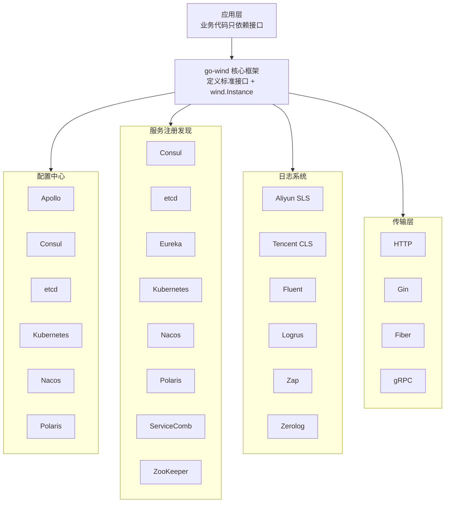

<p align="center">
  <h1 align="center">Go Wind Plugins · 风行插件库</h1>
  <p align="center">
    Go Wind 微服务框架的多引擎插件生态
  </p>
  <p align="center">
    <em>一套接口，多种引擎，按需组装，即插即用</em>
  </p>
</p>

<p align="center">
  <a href="README.md">中文</a> · <a href="README_en.md">English</a> · <a href="README_ja.md">日本語</a>
</p>

<p align="center">
  
  
  
  
</p>

---

## 项目简介

**go-wind-plugins** 是 [go-wind](https://github.com/tx7do/go-wind) 微服务框架的官方插件库，为配置中心、服务注册发现、日志系统和传输层提供统一的抽象接口与多引擎适配实现。

采用**乐高式组合设计**——每个插件只实现核心框架定义的标准接口，你可以根据实际技术栈自由选择底层引擎，切换引擎时无需改动业务代码。

---

## 项目亮点

- **统一接口**：四大领域（Config / Registry / Log / Transport）均由核心框架定义标准接口，插件只做实现
- **多引擎支持**：6 种配置中心、8 种注册中心、6 种日志后端、3 种 HTTP 驱动，覆盖主流技术栈
- **零侵入**：业务代码只依赖接口，不依赖具体引擎 SDK
- **独立版本**：每个子模块独立 `go.mod`，按需引入，避免依赖膨胀
- **Workspace 协同**：通过 `go.work` 管理多模块，开发体验如单仓项目

---

## 核心接口

### 配置中心（Config）

| 接口 | 方法 | 说明 |
|------|------|------|
| `Reader` | `Load(ctx, key) ([]byte, error)` | 按 key 一次性加载配置 |
| `Watcher` | `Watch(ctx, key) (<-chan struct{}, error)` | 信号模式，值变更时通知 |
| `ValueWatcher` | `WatchValue(ctx, key) (<-chan []byte, error)` | 推值模式，直接推送新值 |
| `Closer` | `Close() error` | 资源释放 |
| `Decoder` | `Decode(data, out) error` | 原始字节反序列化 |

### 服务注册发现（Registry）

| 接口 | 方法 | 说明 |
|------|------|------|
| `Registrar` | `Register(ctx, *Instance)` / `Deregister(ctx, *Instance)` | 服务注册与注销 |
| `Discovery` | `GetService(ctx, name)` / `Watch(ctx, name)` | 服务发现与监听 |
| `Watcher` | `Next(ctx) ([]*Instance, error)` / `Stop()` | 实例变更流 |

### 日志（Log）

| 接口 | 方法 | 说明 |
|------|------|------|
| `Logger` | `Debug/Info/Warn/Error(ctx, msg, keyvals...)` | 四级日志输出 |
| `Logger` | `With(keyvals...) Logger` | 附加上下文字段 |
| `Logger` | `Enabled(Level) bool` | 级别判断 |

### 传输层（Transport）

| 接口 | 方法 | 说明 |
|------|------|------|
| `Server` (HTTP) | `Handle / GET / POST / PUT / DELETE...` | 路由注册 |
| `Server` (HTTP) | `Start(ctx)` / `Stop(ctx)` / `Endpoint()` | 生命周期管理 |
| `Driver` (HTTP) | `Handle / Start / Stop` | 框架适配驱动 |

---

## 插件矩阵

### 配置中心（Config）

| 插件 | 模块路径 | 引擎 |
|------|---------|------|
| Apollo | `github.com/tx7do/go-wind-plugins/config/apollo` | 携程 Apollo |
| Consul | `github.com/tx7do/go-wind-plugins/config/consul` | HashiCorp Consul KV |
| Etcd | `github.com/tx7do/go-wind-plugins/config/etcd` | CoreOS etcd |
| Kubernetes | `github.com/tx7do/go-wind-plugins/config/kubernetes` | K8s ConfigMap / Secret |
| Nacos | `github.com/tx7do/go-wind-plugins/config/nacos` | 阿里云 Nacos |
| Polaris | `github.com/tx7do/go-wind-plugins/config/polaris` | 腾讯云 Polaris |

### 服务注册发现（Registry）

| 插件 | 模块路径 | 引擎 |
|------|---------|------|
| Consul | `github.com/tx7do/go-wind-plugins/registry/consul` | HashiCorp Consul |
| Etcd | `github.com/tx7do/go-wind-plugins/registry/etcd` | CoreOS etcd |
| Eureka | `github.com/tx7do/go-wind-plugins/registry/eureka` | Netflix Eureka |
| Kubernetes | `github.com/tx7do/go-wind-plugins/registry/kubernetes` | K8s Endpoints |
| Nacos | `github.com/tx7do/go-wind-plugins/registry/nacos` | 阿里云 Nacos |
| Polaris | `github.com/tx7do/go-wind-plugins/registry/polaris` | 腾讯云 Polaris |
| ServiceComb | `github.com/tx7do/go-wind-plugins/registry/servicecomb` | Apache ServiceComb |
| Zookeeper | `github.com/tx7do/go-wind-plugins/registry/zookeeper` | Apache ZooKeeper |

### 日志（Log）

| 插件 | 模块路径 | 引擎 |
|------|---------|------|
| Aliyun SLS | `github.com/tx7do/go-wind-plugins/log/aliyun` | 阿里云日志服务 SLS |
| Tencent CLS | `github.com/tx7do/go-wind-plugins/log/tencent` | 腾讯云日志服务 CLS |
| Fluent | `github.com/tx7do/go-wind-plugins/log/fluent` | Fluentd |
| Logrus | `github.com/tx7do/go-wind-plugins/log/logrus` | sirupsen/logrus |
| Zap | `github.com/tx7do/go-wind-plugins/log/zap` | uber-go/zap |
| Zerolog | `github.com/tx7do/go-wind-plugins/log/zerolog` | rs/zerolog |

### 传输层（Transport）

| 插件 | 模块路径 | 引擎 |
|------|---------|------|
| HTTP (标准库) | `github.com/tx7do/go-wind-plugins/transport/http` | net/http |
| HTTP (Gin) | `github.com/tx7do/go-wind-plugins/transport/http/gin` | gin-gonic/gin |
| HTTP (Fiber) | `github.com/tx7do/go-wind-plugins/transport/http/fiber` | gofiber/fiber |
| gRPC | `github.com/tx7do/go-wind-plugins/transport/grpc` | google.golang.org/grpc |

---

## 架构设计



---

## 项目结构

```
go-wind-plugins/
├── config/                         # 配置中心接口与插件
│   ├── config.go                   # 标准接口定义（Reader/Watcher/ValueWatcher...）
│   ├── go.mod
│   ├── apollo/                     # 携程 Apollo 配置中心
│   ├── consul/                     # HashiCorp Consul KV
│   ├── etcd/                       # CoreOS etcd 配置中心
│   ├── kubernetes/                 # Kubernetes ConfigMap/Secret
│   ├── nacos/                      # 阿里云 Nacos 配置中心
│   └── polaris/                    # 腾讯云 Polaris 配置中心
│
├── registry/                       # 服务注册发现接口与插件
│   ├── registrar.go                # Registrar 接口定义
│   ├── discovery.go                # Discovery / Watcher 接口定义
│   ├── go.mod
│   ├── consul/                     # HashiCorp Consul
│   ├── etcd/                       # CoreOS etcd
│   ├── eureka/                     # Netflix Eureka
│   ├── kubernetes/                 # Kubernetes Endpoints
│   ├── nacos/                      # 阿里云 Nacos
│   ├── polaris/                    # 腾讯云 Polaris
│   ├── servicecomb/                # Apache ServiceComb
│   └── zookeeper/                  # Apache ZooKeeper
│
├── log/                            # 日志接口与适配器
│   ├── slog_logger.go              # 标准库 slog 适配器（默认实现）
│   ├── level_filter.go             # 级别过滤器
│   ├── multi_logger.go             # 多路日志器
│   ├── go.mod
│   ├── aliyun/                     # 阿里云 SLS 日志服务
│   ├── fluent/                     # Fluentd
│   ├── logrus/                     # sirupsen/logrus
│   ├── tencent/                    # 腾讯云 CLS 日志服务
│   ├── zap/                        # uber-go/zap
│   └── zerolog/                    # rs/zerolog
│
├── transport/                      # 传输层接口与驱动
│   ├── http/                       # HTTP Server + Driver 接口 + 默认驱动
│   │   ├── server.go               # Server 实现（路由/中间件/TLS）
│   │   ├── default_server.go       # 基于标准库的默认驱动
│   │   ├── options.go              # 配置选项
│   │   ├── gin/                    # Gin 驱动
│   │   └── fiber/                  # Fiber 驱动
│   └── grpc/                       # gRPC Server
│
├── go.work                         # Go Workspace 多模块管理
├── LICENSE
└── README.md
```

---

## 快速开始

### 安装

```bash
# 按需引入，例如使用 etcd 作为配置中心 + nacos 作为注册中心
go get github.com/tx7do/go-wind-plugins/config/etcd
go get github.com/tx7do/go-wind-plugins/registry/nacos
go get github.com/tx7do/go-wind-plugins/log/zap
```

### 配置中心示例（etcd）

```go
package main

import (
    "context"
    "fmt"

    clientv3 "go.etcd.io/etcd/client/v3"

    "github.com/tx7do/go-wind-plugins/config/etcd"
)

func main() {
    client, err := clientv3.New(clientv3.Config{
        Endpoints: []string{"localhost:2379"},
    })
    if err != nil {
        panic(err)
    }

    cfg, err := etcd.New(client)
    if err != nil {
        panic(err)
    }

    // 加载配置
    data, err := cfg.Load(context.Background(), "/myapp/config")
    if err != nil {
        panic(err)
    }
    fmt.Println("config:", string(data))

    // 监听配置变更
    ch, _ := cfg.WatchValue(context.Background(), "/myapp/config")
    for val := range ch {
        fmt.Println("config updated:", string(val))
    }
}
```

### 服务注册发现示例（nacos）

```go
package main

import (
    "context"
    "fmt"

    "github.com/nacos-group/nacos-sdk-go/v2/clients"
    "github.com/nacos-group/nacos-sdk-go/v2/common/constant"
    "github.com/nacos-group/nacos-sdk-go/v2/vo"
    wind "github.com/tx7do/go-wind"

    "github.com/tx7do/go-wind-plugins/registry/nacos"
)

func main() {
    client, _ := clients.NewNamingClient(vo.NacosClientParam{
        ServerConfigs: []constant.ServerConfig{
            {IpAddr: "127.0.0.1", Port: 8848},
        },
        ClientConfig: &constant.ClientConfig{
            NamespaceId: "public",
        },
    })

    r := nacos.New(client)

    // 注册服务
    instance := &wind.Instance{
        Name:      "my-service",
        Version:   "v1.0.0",
        Endpoints: []string{"grpc://127.0.0.1:8080"},
    }
    _ = r.Register(context.Background(), instance)

    // 服务发现
    services, _ := r.GetService(context.Background(), "my-service.grpc")
    for _, svc := range services {
        fmt.Printf("found: %+v\n", svc)
    }
}
```

### HTTP 服务器示例（Gin 驱动）

```go
package main

import (
    "context"
    "net/http"

    httpPlugin "github.com/tx7do/go-wind-plugins/transport/http"
    "github.com/tx7do/go-wind-plugins/transport/http/gin"
)

func main() {
    srv := httpPlugin.NewServer(":8080",
        httpPlugin.WithDriver(gin.NewDriver()),
        httpPlugin.WithMiddleware(func(next http.Handler) http.Handler {
            return http.HandlerFunc(func(w http.ResponseWriter, r *http.Request) {
                w.Header().Set("X-Engine", "gin")
                next.ServeHTTP(w, r)
            })
        }),
    )

    srv.GET("/", func(w http.ResponseWriter, r *http.Request) {
        w.Write([]byte("Hello from Gin driver!"))
    })

    srv.Start(context.Background())
}
```

### 日志示例（Zap）

```go
package main

import (
    "context"
    "github.com/tx7do/go-wind-plugins/log/zap"
)

func main() {
    logger, _ := zap.NewZapLogger()
    logger.Info(context.Background(), "service started", "port", 8080)
    logger.With("module", "auth").Error(context.Background(), "token expired")
}
```

---

## 设计理念

### 乐高式组合

go-wind-plugins 遵循 **接口优先、实现可选** 的设计原则：

1. **核心框架定义接口**：`go-wind` 定义 `Reader`、`Registrar`、`Logger`、`Server` 等标准接口
2. **插件实现接口**：每个插件模块只实现对应的标准接口，如 etcd 配置中心实现 `config.Reader` + `config.ValueWatcher`
3. **应用层注入**：业务代码通过接口引用插件，编译时选择具体实现，切换引擎只需改一行 import

### 独立版本管理

每个子模块拥有独立的 `go.mod`，可以单独发布版本：

```
github.com/tx7do/go-wind-plugins/config      # 接口定义包
github.com/tx7do/go-wind-plugins/config/etcd  # etcd 实现
github.com/tx7do/go-wind-plugins/registry     # 接口定义包
github.com/tx7do/go-wind-plugins/registry/nacos # nacos 实现
```

---

## 参与贡献

欢迎提交 Issue 和 Pull Request！

1. Fork 本仓库
2. 创建特性分支：`git checkout -b feature/new-plugin`
3. 提交变更：`git commit -m 'feat: add new plugin'`
4. 推送分支：`git push origin feature/new-plugin`
5. 提交 Pull Request

---

## 开源许可

[MIT License](LICENSE) © 2026 GoWind
