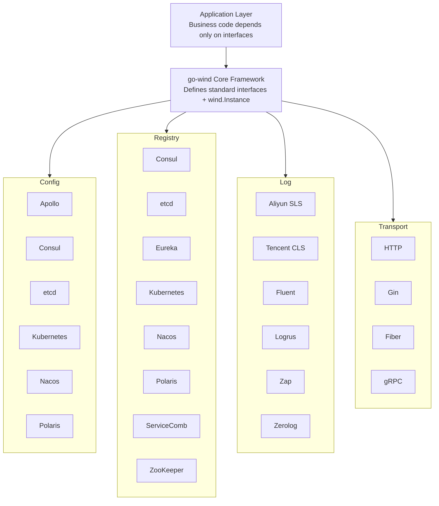

<p align="center">
  <h1 align="center">Go Wind Plugins</h1>
  <p align="center">
    Multi-engine plugin ecosystem for the Go Wind microservice framework
  </p>
  <p align="center">
    <em>One interface, multiple engines, assemble as needed, plug and play</em>
  </p>
</p>

<p align="center">
  <a href="README.md">中文</a> · <a href="README_en.md">English</a> · <a href="README_ja.md">日本語</a>
</p>

<p align="center">
  
  
  
  
</p>

---

## Overview

**go-wind-plugins** is the official plugin library for the [go-wind](https://github.com/tx7do/go-wind) microservice framework. It provides unified abstraction interfaces and multi-engine implementations for configuration centers, service discovery, logging systems, and transport layers.

Built with a **Lego-like composition design** — each plugin implements only the standard interfaces defined by the core framework. You can freely choose the underlying engine based on your tech stack, and switching engines requires no business code changes.

---

## Key Features

- **Unified Interfaces**: Four domains (Config / Registry / Log / Transport) with standard interfaces defined by the core framework
- **Multi-Engine Support**: 6 config centers, 8 registry providers, 6 logging backends, 3 HTTP drivers — covering mainstream tech stacks
- **Zero Intrusion**: Business code depends only on interfaces, never on specific engine SDKs
- **Independent Versioning**: Each submodule has its own `go.mod`, import only what you need
- **Workspace Synergy**: Managed via `go.work` for a single-repo development experience

---

## Core Interfaces

### Config

| Interface | Methods | Description |
|-----------|---------|-------------|
| `Reader` | `Load(ctx, key) ([]byte, error)` | One-shot config loading by key |
| `Watcher` | `Watch(ctx, key) (<-chan struct{}, error)` | Signal-mode change notification |
| `ValueWatcher` | `WatchValue(ctx, key) (<-chan []byte, error)` | Push-mode change with value delivery |
| `Closer` | `Close() error` | Resource cleanup |
| `Decoder` | `Decode(data, out) error` | Raw bytes deserialization |

### Registry

| Interface | Methods | Description |
|-----------|---------|-------------|
| `Registrar` | `Register(ctx, *Instance)` / `Deregister(ctx, *Instance)` | Service registration lifecycle |
| `Discovery` | `GetService(ctx, name)` / `Watch(ctx, name)` | Service discovery and watching |
| `Watcher` | `Next(ctx) ([]*Instance, error)` / `Stop()` | Instance change stream |

### Log

| Interface | Methods | Description |
|-----------|---------|-------------|
| `Logger` | `Debug/Info/Warn/Error(ctx, msg, keyvals...)` | Four-level logging |
| `Logger` | `With(keyvals...) Logger` | Attach context fields |
| `Logger` | `Enabled(Level) bool` | Level filtering |

### Transport

| Interface | Methods | Description |
|-----------|---------|-------------|
| `Server` (HTTP) | `Handle / GET / POST / PUT / DELETE...` | Route registration |
| `Server` (HTTP) | `Start(ctx)` / `Stop(ctx)` / `Endpoint()` | Lifecycle management |
| `Driver` (HTTP) | `Handle / Start / Stop` | Framework adapter driver |

---

## Plugin Matrix

### Config

| Plugin | Module Path | Engine |
|--------|------------|--------|
| Apollo | `github.com/tx7do/go-wind-plugins/config/apollo` | Ctrip Apollo |
| Consul | `github.com/tx7do/go-wind-plugins/config/consul` | HashiCorp Consul KV |
| Etcd | `github.com/tx7do/go-wind-plugins/config/etcd` | CoreOS etcd |
| Kubernetes | `github.com/tx7do/go-wind-plugins/config/kubernetes` | K8s ConfigMap / Secret |
| Nacos | `github.com/tx7do/go-wind-plugins/config/nacos` | Alibaba Nacos |
| Polaris | `github.com/tx7do/go-wind-plugins/config/polaris` | Tencent Polaris |

### Registry

| Plugin | Module Path | Engine |
|--------|------------|--------|
| Consul | `github.com/tx7do/go-wind-plugins/registry/consul` | HashiCorp Consul |
| Etcd | `github.com/tx7do/go-wind-plugins/registry/etcd` | CoreOS etcd |
| Eureka | `github.com/tx7do/go-wind-plugins/registry/eureka` | Netflix Eureka |
| Kubernetes | `github.com/tx7do/go-wind-plugins/registry/kubernetes` | K8s Endpoints |
| Nacos | `github.com/tx7do/go-wind-plugins/registry/nacos` | Alibaba Nacos |
| Polaris | `github.com/tx7do/go-wind-plugins/registry/polaris` | Tencent Polaris |
| ServiceComb | `github.com/tx7do/go-wind-plugins/registry/servicecomb` | Apache ServiceComb |
| Zookeeper | `github.com/tx7do/go-wind-plugins/registry/zookeeper` | Apache ZooKeeper |

### Log

| Plugin | Module Path | Engine |
|--------|------------|--------|
| Aliyun SLS | `github.com/tx7do/go-wind-plugins/log/aliyun` | Alibaba Cloud SLS |
| Tencent CLS | `github.com/tx7do/go-wind-plugins/log/tencent` | Tencent Cloud CLS |
| Fluent | `github.com/tx7do/go-wind-plugins/log/fluent` | Fluentd |
| Logrus | `github.com/tx7do/go-wind-plugins/log/logrus` | sirupsen/logrus |
| Zap | `github.com/tx7do/go-wind-plugins/log/zap` | uber-go/zap |
| Zerolog | `github.com/tx7do/go-wind-plugins/log/zerolog` | rs/zerolog |

### Transport

| Plugin | Module Path | Engine |
|--------|------------|--------|
| HTTP (stdlib) | `github.com/tx7do/go-wind-plugins/transport/http` | net/http |
| HTTP (Gin) | `github.com/tx7do/go-wind-plugins/transport/http/gin` | gin-gonic/gin |
| HTTP (Fiber) | `github.com/tx7do/go-wind-plugins/transport/http/fiber` | gofiber/fiber |
| gRPC | `github.com/tx7do/go-wind-plugins/transport/grpc` | google.golang.org/grpc |

---

## Architecture



---

## Project Structure

```
go-wind-plugins/
├── config/                         # Config center interfaces and plugins
│   ├── config.go                   # Standard interfaces (Reader/Watcher/ValueWatcher...)
│   ├── go.mod
│   ├── apollo/                     # Ctrip Apollo
│   ├── consul/                     # HashiCorp Consul KV
│   ├── etcd/                       # CoreOS etcd
│   ├── kubernetes/                 # Kubernetes ConfigMap/Secret
│   ├── nacos/                      # Alibaba Nacos
│   └── polaris/                    # Tencent Polaris
│
├── registry/                       # Service discovery interfaces and plugins
│   ├── registrar.go                # Registrar interface
│   ├── discovery.go                # Discovery / Watcher interfaces
│   ├── go.mod
│   ├── consul/                     # HashiCorp Consul
│   ├── etcd/                       # CoreOS etcd
│   ├── eureka/                     # Netflix Eureka
│   ├── kubernetes/                 # Kubernetes Endpoints
│   ├── nacos/                      # Alibaba Nacos
│   ├── polaris/                    # Tencent Polaris
│   ├── servicecomb/                # Apache ServiceComb
│   └── zookeeper/                  # Apache ZooKeeper
│
├── log/                            # Logging interfaces and adapters
│   ├── slog_logger.go              # stdlib slog adapter (default)
│   ├── level_filter.go             # Level filter
│   ├── multi_logger.go             # Multi-logger
│   ├── go.mod
│   ├── aliyun/                     # Alibaba Cloud SLS
│   ├── fluent/                     # Fluentd
│   ├── logrus/                     # sirupsen/logrus
│   ├── tencent/                    # Tencent Cloud CLS
│   ├── zap/                        # uber-go/zap
│   └── zerolog/                    # rs/zerolog
│
├── transport/                      # Transport layer interfaces and drivers
│   ├── http/                       # HTTP Server + Driver interface + default driver
│   │   ├── server.go               # Server impl (routing/middleware/TLS)
│   │   ├── default_server.go       # stdlib-based default driver
│   │   ├── options.go              # Configuration options
│   │   ├── gin/                    # Gin driver
│   │   └── fiber/                  # Fiber driver
│   └── grpc/                       # gRPC Server
│
├── go.work                         # Go Workspace multi-module management
├── LICENSE
└── README.md
```

---

## Quick Start

### Installation

```bash
# Import only what you need, e.g. etcd config + nacos registry
go get github.com/tx7do/go-wind-plugins/config/etcd
go get github.com/tx7do/go-wind-plugins/registry/nacos
go get github.com/tx7do/go-wind-plugins/log/zap
```

### Config Example (etcd)

```go
package main

import (
    "context"
    "fmt"

    clientv3 "go.etcd.io/etcd/client/v3"

    "github.com/tx7do/go-wind-plugins/config/etcd"
)

func main() {
    client, err := clientv3.New(clientv3.Config{
        Endpoints: []string{"localhost:2379"},
    })
    if err != nil {
        panic(err)
    }

    cfg, err := etcd.New(client)
    if err != nil {
        panic(err)
    }

    // Load config
    data, err := cfg.Load(context.Background(), "/myapp/config")
    if err != nil {
        panic(err)
    }
    fmt.Println("config:", string(data))

    // Watch config changes
    ch, _ := cfg.WatchValue(context.Background(), "/myapp/config")
    for val := range ch {
        fmt.Println("config updated:", string(val))
    }
}
```

### Registry Example (nacos)

```go
package main

import (
    "context"
    "fmt"

    "github.com/nacos-group/nacos-sdk-go/v2/clients"
    "github.com/nacos-group/nacos-sdk-go/v2/common/constant"
    "github.com/nacos-group/nacos-sdk-go/v2/vo"
    wind "github.com/tx7do/go-wind"

    "github.com/tx7do/go-wind-plugins/registry/nacos"
)

func main() {
    client, _ := clients.NewNamingClient(vo.NacosClientParam{
        ServerConfigs: []constant.ServerConfig{
            {IpAddr: "127.0.0.1", Port: 8848},
        },
        ClientConfig: &constant.ClientConfig{
            NamespaceId: "public",
        },
    })

    r := nacos.New(client)

    // Register service
    instance := &wind.Instance{
        Name:      "my-service",
        Version:   "v1.0.0",
        Endpoints: []string{"grpc://127.0.0.1:8080"},
    }
    _ = r.Register(context.Background(), instance)

    // Discover services
    services, _ := r.GetService(context.Background(), "my-service.grpc")
    for _, svc := range services {
        fmt.Printf("found: %+v\n", svc)
    }
}
```

### HTTP Server Example (Gin driver)

```go
package main

import (
    "context"
    "net/http"

    httpPlugin "github.com/tx7do/go-wind-plugins/transport/http"
    "github.com/tx7do/go-wind-plugins/transport/http/gin"
)

func main() {
    srv := httpPlugin.NewServer(":8080",
        httpPlugin.WithDriver(gin.NewDriver()),
        httpPlugin.WithMiddleware(func(next http.Handler) http.Handler {
            return http.HandlerFunc(func(w http.ResponseWriter, r *http.Request) {
                w.Header().Set("X-Engine", "gin")
                next.ServeHTTP(w, r)
            })
        }),
    )

    srv.GET("/", func(w http.ResponseWriter, r *http.Request) {
        w.Write([]byte("Hello from Gin driver!"))
    })

    srv.Start(context.Background())
}
```

### Logging Example (Zap)

```go
package main

import (
    "context"
    "github.com/tx7do/go-wind-plugins/log/zap"
)

func main() {
    logger, _ := zap.NewZapLogger()
    logger.Info(context.Background(), "service started", "port", 8080)
    logger.With("module", "auth").Error(context.Background(), "token expired")
}
```

---

## Design Philosophy

### Lego-Style Composition

go-wind-plugins follows the principle of **interfaces first, implementations optional**:

1. **Core framework defines interfaces**: `go-wind` defines `Reader`, `Registrar`, `Logger`, `Server` and other standard interfaces
2. **Plugins implement interfaces**: Each plugin module implements only the corresponding standard interface
3. **Application-layer injection**: Business code references plugins through interfaces; switching engines is just an import change

### Independent Versioning

Each submodule has its own `go.mod` and can be versioned independently:

```
github.com/tx7do/go-wind-plugins/config        # Interface definitions
github.com/tx7do/go-wind-plugins/config/etcd    # etcd implementation
github.com/tx7do/go-wind-plugins/registry       # Interface definitions
github.com/tx7do/go-wind-plugins/registry/nacos # nacos implementation
```

---

## Contributing

Issues and Pull Requests are welcome!

1. Fork this repository
2. Create a feature branch: `git checkout -b feature/new-plugin`
3. Commit changes: `git commit -m 'feat: add new plugin'`
4. Push branch: `git push origin feature/new-plugin`
5. Submit a Pull Request

---

## License

[MIT License](LICENSE) © 2026 GoWind
