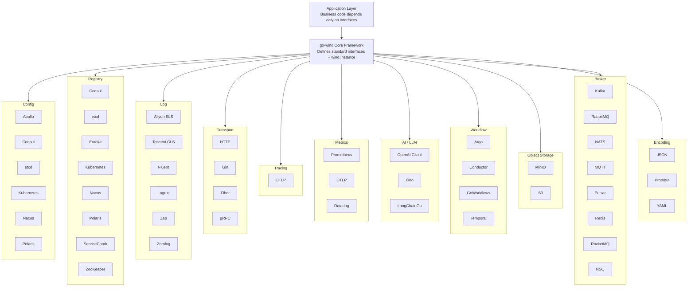

<p align="center">
  <h1 align="center">Go Wind Plugins</h1>
  <p align="center">
    Multi-engine plugin ecosystem for the Go Wind microservice framework
  </p>
  <p align="center">
    <em>One interface, multiple engines, assemble as needed, plug and play</em>
  </p>
</p>

<p align="center">
  <a href="README.md">中文</a> · <a href="README_en.md">English</a> · <a href="README_ja.md">日本語</a>
</p>

<p align="center">
  
  
  
  
</p>

---

## Overview

**go-wind-plugins** is the official plugin library for the [go-wind](https://github.com/tx7do/go-wind) microservice framework. It provides unified abstraction interfaces and multi-engine implementations for configuration centers, service discovery, logging systems, and transport layers.

Built with a **Lego-like composition design** — each plugin implements only the standard interfaces defined by the core framework. You can freely choose the underlying engine based on your tech stack, and switching engines requires no business code changes.

---

## Key Features

- **Unified Interfaces**: Six domains (Config / Registry / Log / Metrics / Transport / Tracer) with standard interfaces defined by the core framework
- **Multi-Engine Support**: 6 config centers, 8 registry providers, 6 logging backends, 3 metrics backends, 3 HTTP drivers, 1 OTLP tracing protocol, 12 message brokers — covering mainstream tech stacks
- **Zero Intrusion**: Business code depends only on interfaces, never on specific engine SDKs
- **Independent Versioning**: Each submodule has its own `go.mod`, import only what you need
- **Workspace Synergy**: Managed via `go.work` for a single-repo development experience

---

## Core Interfaces

### Config

| Interface | Methods | Description |
|-----------|---------|-------------|
| `Reader` | `Load(ctx, key) ([]byte, error)` | One-shot config loading by key |
| `Watcher` | `Watch(ctx, key) (<-chan struct{}, error)` | Signal-mode change notification |
| `ValueWatcher` | `WatchValue(ctx, key) (<-chan []byte, error)` | Push-mode change with value delivery |
| `Closer` | `Close() error` | Resource cleanup |
| `Decoder` | `Decode(data, out) error` | Raw bytes deserialization |

### Registry

| Interface | Methods | Description |
|-----------|---------|-------------|
| `Registrar` | `Register(ctx, *Instance)` / `Deregister(ctx, *Instance)` | Service registration lifecycle |
| `Discovery` | `GetService(ctx, name)` / `Watch(ctx, name)` | Service discovery and watching |
| `Watcher` | `Next(ctx) ([]*Instance, error)` / `Stop()` | Instance change stream |

### Log

| Interface | Methods | Description |
|-----------|---------|-------------|
| `Logger` | `Debug/Info/Warn/Error(ctx, msg, keyvals...)` | Four-level logging |
| `Logger` | `With(keyvals...) Logger` | Attach context fields |
| `Logger` | `Enabled(Level) bool` | Level filtering |

### Transport

| Interface | Methods | Description |
|-----------|---------|-------------|
| `Server` (HTTP) | `Handle / GET / POST / PUT / DELETE...` | Route registration |
| `Server` (HTTP) | `Start(ctx)` / `Stop(ctx)` / `Endpoint()` | Lifecycle management |
| `Driver` (HTTP) | `Handle / Start / Stop` | Framework adapter driver |

### Tracer

> Based on the OpenTelemetry standard. No custom interface — uses native OTel types directly.

| Type | Methods | Description |
|------|---------|-------------|
| `*sdktrace.TracerProvider` | `Tracer(name) trace.Tracer` | Create a standard OTel Tracer |
| `*sdktrace.TracerProvider` | `Shutdown(ctx)` | Shutdown provider, flush pending spans |
| `trace.Tracer` | `Start(ctx, name, opts...)` | Create span, inject trace context |

### Metrics

| Interface | Methods | Description |
|-----------|---------|-------------|
| `Metrics` | `Counter(ctx, name, value, labels)` | Monotonically increasing counter (requests, errors) |
| `Metrics` | `Histogram(ctx, name, value, labels)` | Distribution of observations (latency, payload size) |
| `Metrics` | `Gauge(ctx, name, value, labels)` | Point-in-time value (queue depth, active connections) |
| `Closer` | `Close() error` | Close and flush pending data |

### Broker

| Interface | Methods | Description |
|------|------|------|
| `Broker` | `Name() string` | Get broker name |
| `Broker` | `Address() string` | Get broker address |
| `Broker` | `Init(...Option) error` | Initialize broker |
| `Broker` | `Connect() / Disconnect() error` | Connect / Disconnect |
| `Broker` | `Publish(ctx, topic, *Message, ...PublishOption) error` | Publish message to topic |
| `Broker` | `Subscribe(topic, Handler, Binder, ...SubscribeOption) (Subscriber, error)` | Subscribe to topic |
| `Broker` | `Request(ctx, topic, *Message, ...RequestOption) (*Message, error)` | Request-response pattern |
| `Message` | `Headers / Body / Key` | Message headers, body, partition key |
| `Event` | `Topic() / Message() / Ack() / Error()` | Event received by subscriber |
| `Subscriber` | `Unsubscribe() error` | Unsubscribe |

### AI / LLM

> The three frameworks return incompatible types — no abstraction interface is defined.
> Only a shared config type `ai.Config` is provided.
>
> Each plugin constructor returns its framework's native type directly.

| Input | Constructor | Returns |
|-------|-------------|---------|
| `ai.Config` | `model.NewClient(cfg)` | `*openai.Client` |
| `ai.Config` | `eino.NewChatModel(ctx, cfg)` | `model.ChatModel` (Eino interface) |
| `ai.Config` | `langchaingo.NewModel(cfg)` | `llms.Model` (LangChainGo interface) |

### Encoding

| Interface/Func | Method | Description |
|------|------|------|
| `Codec` | `Marshal(v) ([]byte, error)` | Serialize |
| `Codec` | `Unmarshal(data, v) error` | Deserialize |
| `Codec` | `Name() string` | Codec name (json/proto/yaml) |
| Package funcs | `RegisterCodec(c)` / `GetCodec(name)` | Global registry |

---

## Plugin Matrix

### Config

| Plugin | Module Path | Engine |
|--------|------------|--------|
| Apollo | `github.com/tx7do/go-wind-plugins/config/apollo` | Ctrip Apollo |
| Consul | `github.com/tx7do/go-wind-plugins/config/consul` | HashiCorp Consul KV |
| Etcd | `github.com/tx7do/go-wind-plugins/config/etcd` | CoreOS etcd |
| Kubernetes | `github.com/tx7do/go-wind-plugins/config/kubernetes` | K8s ConfigMap / Secret |
| Nacos | `github.com/tx7do/go-wind-plugins/config/nacos` | Alibaba Nacos |
| Polaris | `github.com/tx7do/go-wind-plugins/config/polaris` | Tencent Polaris |

### Registry

| Plugin | Module Path | Engine |
|--------|------------|--------|
| Consul | `github.com/tx7do/go-wind-plugins/registry/consul` | HashiCorp Consul |
| Etcd | `github.com/tx7do/go-wind-plugins/registry/etcd` | CoreOS etcd |
| Eureka | `github.com/tx7do/go-wind-plugins/registry/eureka` | Netflix Eureka |
| Kubernetes | `github.com/tx7do/go-wind-plugins/registry/kubernetes` | K8s Endpoints |
| Nacos | `github.com/tx7do/go-wind-plugins/registry/nacos` | Alibaba Nacos |
| Polaris | `github.com/tx7do/go-wind-plugins/registry/polaris` | Tencent Polaris |
| ServiceComb | `github.com/tx7do/go-wind-plugins/registry/servicecomb` | Apache ServiceComb |
| Zookeeper | `github.com/tx7do/go-wind-plugins/registry/zookeeper` | Apache ZooKeeper |

### Log

| Plugin | Module Path | Engine |
|--------|------------|--------|
| Aliyun SLS | `github.com/tx7do/go-wind-plugins/log/aliyun` | Alibaba Cloud SLS |
| Tencent CLS | `github.com/tx7do/go-wind-plugins/log/tencent` | Tencent Cloud CLS |
| Fluent | `github.com/tx7do/go-wind-plugins/log/fluent` | Fluentd |
| Logrus | `github.com/tx7do/go-wind-plugins/log/logrus` | sirupsen/logrus |
| Zap | `github.com/tx7do/go-wind-plugins/log/zap` | uber-go/zap |
| Zerolog | `github.com/tx7do/go-wind-plugins/log/zerolog` | rs/zerolog |

### Transport

| Plugin | Module Path | Engine |
|--------|------------|--------|
| HTTP (stdlib) | `github.com/tx7do/go-wind-plugins/transport/http` | net/http |
| HTTP (Gin) | `github.com/tx7do/go-wind-plugins/transport/http/gin` | gin-gonic/gin |
| HTTP (Fiber) | `github.com/tx7do/go-wind-plugins/transport/http/fiber` | gofiber/fiber |
| gRPC | `github.com/tx7do/go-wind-plugins/transport/grpc` | google.golang.org/grpc |

### Tracer

| Plugin | Module Path | Engine |
|--------|------------|--------|
| OTLP | `github.com/tx7do/go-wind-plugins/tracer/otlp` | OpenTelemetry Protocol (OTLP) |

**Note**: OTLP is the standard protocol of OpenTelemetry, supporting all major backends: Jaeger, Zipkin, SkyWalking, Tempo (Grafana), Datadog, Alibaba Cloud ARMS, Tencent Cloud APM, etc. Just configure the endpoint to switch backends without changing plugins.

### Metrics

| Plugin | Module Path | Engine |
|--------|------------|--------|
| Prometheus | `github.com/tx7do/go-wind-plugins/metrics/prometheus` | Prometheus client_golang |
| OpenTelemetry | `github.com/tx7do/go-wind-plugins/metrics/otel` | OTLP (gRPC/HTTP) |
| Datadog | `github.com/tx7do/go-wind-plugins/metrics/datadog` | DogStatsD |

### AI / LLM

| Plugin | Module Path | Framework |
|--------|------------|-----------|
| OpenAI Client | `github.com/tx7do/go-wind-plugins/ai/openai` | sashabaranov/go-openai |
| Eino | `github.com/tx7do/go-wind-plugins/ai/eino` | cloudwego/eino |
| LangChainGo | `github.com/tx7do/go-wind-plugins/ai/langchaingo` | tmc/langchaingo |

### Encoding

| Plugin | Module Path | Engine |
|--------|------------|--------|
| JSON | `github.com/tx7do/go-wind-plugins/encoding/json` | encoding/json |
| Protobuf | `github.com/tx7do/go-wind-plugins/encoding/proto` | google.golang.org/protobuf |
| YAML | `github.com/tx7do/go-wind-plugins/encoding/yaml` | gopkg.in/yaml.v3 |

### Workflow

> The four engines have incompatible workflow operation parameters and return types. Only a minimal common interface `workflow.Client` (`Close() error`) is extracted.

| Plugin | Module Path | Framework |
|--------|------------|-----------|
| Argo Workflows | `github.com/tx7do/go-wind-plugins/workflow/argo` | Argo Workflows REST API |
| Conductor | `github.com/tx7do/go-wind-plugins/workflow/conductor` | conductor-sdk/conductor-go |
| GoWorkflows | `github.com/tx7do/go-wind-plugins/workflow/goworkflows` | cschleiden/go-workflows |
| Temporal | `github.com/tx7do/go-wind-plugins/workflow/temporal` | temporal.io/sdk |

### Object Storage

> The two OSS implementations have incompatible SDKs and return types. Each defines its own local `Config`; no shared interface is extracted.

| Plugin | Module Path | Framework |
|--------|------------|-----------|
| MinIO | `github.com/tx7do/go-wind-plugins/oss/minio` | minio/minio-go |
| S3 | `github.com/tx7do/go-wind-plugins/oss/s3` | aws/aws-sdk-go-v2 |

### Broker

> Each Broker engine has its own SDK and configuration options, but all implement the core `broker.Broker` interface.

| Plugin | Module Path | Engine |
|--------|------------|--------|
| Kafka | `github.com/tx7do/go-wind-plugins/broker/kafka` | segmentio/kafka-go |
| RabbitMQ | `github.com/tx7do/go-wind-plugins/broker/rabbitmq` | rabbitmq/amqp091-go |
| NATS | `github.com/tx7do/go-wind-plugins/broker/nats` | nats-io/nats.go |
| MQTT | `github.com/tx7do/go-wind-plugins/broker/mqtt` | eclipse/paho.mqtt.golang |
| Pulsar | `github.com/tx7do/go-wind-plugins/broker/pulsar` | apache/pulsar-client-go |
| Redis | `github.com/tx7do/go-wind-plugins/broker/redis` | gomodule/redigo |
| RocketMQ | `github.com/tx7do/go-wind-plugins/broker/rocketmq` | apache/rocketmq-client-go + rocketmq-clients |
| NSQ | `github.com/tx7do/go-wind-plugins/broker/nsq` | nsqio/go-nsq |
| SQS | `github.com/tx7do/go-wind-plugins/broker/sqs` | aws/aws-sdk-go-v2 |
| GCP PubSub | `github.com/tx7do/go-wind-plugins/broker/gcpubsub` | cloud.google.com/go/pubsub |
| Azure Service Bus | `github.com/tx7do/go-wind-plugins/broker/azuresb` | azure-sdk-for-go |
| STOMP | `github.com/tx7do/go-wind-plugins/broker/stomp` | go-stomp/stomp |

---

## Architecture



---

## Project Structure

```
go-wind-plugins/
├── config/                         # Config center interfaces and plugins
│   ├── config.go                   # Standard interfaces (Reader/Watcher/ValueWatcher...)
│   ├── go.mod
│   ├── apollo/                     # Ctrip Apollo
│   ├── consul/                     # HashiCorp Consul KV
│   ├── etcd/                       # CoreOS etcd
│   ├── kubernetes/                 # Kubernetes ConfigMap/Secret
│   ├── nacos/                      # Alibaba Nacos
│   └── polaris/                    # Tencent Polaris
│
├── registry/                       # Service discovery interfaces and plugins
│   ├── registrar.go                # Registrar interface
│   ├── discovery.go                # Discovery / Watcher interfaces
│   ├── go.mod
│   ├── consul/                     # HashiCorp Consul
│   ├── etcd/                       # CoreOS etcd
│   ├── eureka/                     # Netflix Eureka
│   ├── kubernetes/                 # Kubernetes Endpoints
│   ├── nacos/                      # Alibaba Nacos
│   ├── polaris/                    # Tencent Polaris
│   ├── servicecomb/                # Apache ServiceComb
│   └── zookeeper/                  # Apache ZooKeeper
│
├── log/                            # Logging interfaces and adapters
│   ├── slog_logger.go              # stdlib slog adapter (default)
│   ├── level_filter.go             # Level filter
│   ├── multi_logger.go             # Multi-logger
│   ├── go.mod
│   ├── aliyun/                     # Alibaba Cloud SLS
│   ├── fluent/                     # Fluentd
│   ├── logrus/                     # sirupsen/logrus
│   ├── tencent/                    # Tencent Cloud CLS
│   ├── zap/                        # uber-go/zap
│   └── zerolog/                    # rs/zerolog
│
├── transport/                      # Transport layer interfaces and drivers
│   ├── http/                       # HTTP Server + Driver interface + default driver
│   │   ├── server.go               # Server impl (routing/middleware/TLS)
│   │   ├── default_server.go       # stdlib-based default driver
│   │   ├── options.go              # Configuration options
│   │   ├── gin/                    # Gin driver
│   │   └── fiber/                  # Fiber driver
│   └── grpc/                       # gRPC Server
│
├── tracer/                         # Distributed tracing plugins
│   ├── tracer.go                   # Package documentation
│   ├── go.mod
│   └── otlp/                       # OpenTelemetry Protocol (OTLP) implementation
│       ├── otlp.go                 # Returns native *sdktrace.TracerProvider
│       └── go.mod
│
├── metrics/                        # Metrics interfaces and plugins
│   ├── metrics.go                  # Metrics interface (Counter/Histogram/Gauge)
│   ├── doc.go                      # Package documentation
│   ├── go.mod
│   ├── prometheus/                 # Prometheus client_golang implementation
│   │   ├── prometheus.go           # Prometheus provider
│   │   └── go.mod
│   ├── otel/                       # OpenTelemetry OTLP implementation
│   │   ├── otel.go                 # OTLP metric exporter configuration
│   │   └── go.mod
│   └── datadog/                    # Datadog DogStatsD implementation
│       ├── datadog.go              # DogStatsD provider
│       └── go.mod
│
├── ai/                             # AI / LLM plugins (independent self-contained modules)
│   ├── openai/                     # OpenAI-compatible client (sashabaranov/go-openai)
│   │   ├── client.go               # Returns *openai.Client
│   │   ├── config.go               # Local Config types
│   │   ├── options.go              # HTTP client options
│   │   └── go.mod
│   ├── eino/                       # ByteDance Eino framework (cloudwego/eino)
│   │   ├── client.go               # Returns model.ChatModel
│   │   ├── config.go               # Local Config types
│   │   ├── compose.go              # Chain/Graph/Workflow helpers
│   │   ├── chain.go                # Chain node append methods
│   │   ├── prompt.go               # ChatTemplate helpers
│   │   ├── tool.go                 # Tool node helpers
│   │   ├── options.go              # ChatModel config modifier
│   │   └── go.mod
│   └── langchaingo/                # LangChainGo (tmc/langchaingo)
│       ├── client.go               # Returns llms.Model
│       ├── config.go               # Local Config types
│       ├── agent.go                # Agent / Executor helpers
│       ├── chain.go                # Chain helpers
│       ├── memory.go               # Memory helpers
│       ├── embedding.go            # Embedding helpers
│       ├── vectorstore.go          # VectorStore helpers
│       ├── options.go              # OpenAI/Ollama/HTTP options
│       └── go.mod
│
├── workflow/                      # Workflow engine plugins (defines Client/Worker interfaces)
│   ├── workflow.go                # Common interfaces (Client/Worker)
│   ├── go.mod
│   ├── argo/                      # Argo Workflows (REST API)
│   │   ├── client.go              # Submit/Get/Suspend/Resume/Terminate
│   │   ├── options.go             # Config options + Argo type definitions
│   │   ├── logger.go              # slog logging wrapper
│   │   └── go.mod
│   ├── conductor/                 # Netflix Conductor (conductor-go SDK)
│   │   ├── client.go              # Start/Get/Pause/Resume/Terminate
│   │   ├── worker.go              # Task Worker
│   │   ├── options.go             # Config options
│   │   ├── logger.go
│   │   └── go.mod
│   ├── goworkflows/               # cschleiden/go-workflows
│   │   ├── client.go              # Create/Cancel/Signal/Wait
│   │   ├── worker.go              # Workflow + Activity Worker
│   │   ├── options.go             # Worker options
│   │   ├── logger.go
│   │   └── go.mod
│   └── temporal/                  # Temporal (temporal.io/sdk)
│       ├── client.go              # Execute/Signal/Query/Cancel (native OTel tracing)
│       ├── worker.go              # Worker + built-in message processing Activity
│       ├── workflow.go            # Built-in BrokerMessageWorkflow
│       ├── options.go             # Config options
│       ├── logger.go
│       └── go.mod
│
├── encoding/                      # Encoding interfaces and plugins
│   ├── encoding.go                # Codec interface definition + registry
│   ├── go.mod
│   ├── json/                      # JSON codec (encoding/json)
│   │   ├── json.go
│   │   └── go.mod
│   ├── proto/                     # Protobuf codec (google.golang.org/protobuf)
│   │   ├── proto.go
│   │   └── go.mod
│   └── yaml/                      # YAML codec (gopkg.in/yaml.v3)
│       ├── yaml.go
│       └── go.mod
│
├── oss/                           # Object storage plugins (self-contained config)
│   ├── minio/                     # MinIO (minio/minio-go)
│   │   ├── client.go              # Returns *minio.Client
│   │   ├── config.go              # Local Config types
│   │   └── go.mod
│   └── s3/                        # AWS S3 compatible (aws-sdk-go-v2)
│       ├── client.go              # Returns *s3.Client
│       ├── storage.go             # Storage wrapper (default bucket)
│       ├── config.go              # Local Config types
│       ├── errors.go              # Sentinel errors
│       └── go.mod
│
├── broker/                        # Message broker interfaces and plugins
│   ├── broker.go                  # Broker interface (Publish/Subscribe/Request)
│   ├── message.go                 # Message struct (Headers/Body/Key)
│   ├── event.go                   # Event interface (Topic/Message/Ack)
│   ├── options.go                 # Broker configuration options
│   ├── subscriber.go              # Subscriber management (SubscriberSyncMap)
│   ├── encoding.go                # Message encoding integration
│   ├── publish.go                 # Publish middleware chain
│   ├── typed_handler.go           # Generic TypedHandler support
│   ├── go.mod
│   ├── kafka/                     # Apache Kafka (segmentio/kafka-go)
│   ├── rabbitmq/                  # RabbitMQ (rabbitmq/amqp091-go)
│   ├── nats/                      # NATS JetStream (nats-io/nats.go)
│   ├── mqtt/                      # MQTT (eclipse/paho.mqtt.golang)
│   ├── pulsar/                    # Apache Pulsar (apache/pulsar-client-go)
│   ├── redis/                     # Redis Pub/Sub (gomodule/redigo)
│   ├── rocketmq/                  # Apache RocketMQ (dual SDK support)
│   ├── nsq/                       # NSQ (nsqio/go-nsq)
│   ├── sqs/                       # AWS SQS (aws/aws-sdk-go-v2)
│   ├── gcpubsub/                  # Google Cloud Pub/Sub
│   ├── azuresb/                   # Azure Service Bus
│   └── stomp/                     # STOMP protocol
│
├── go.work                         # Go Workspace multi-module management
├── LICENSE
└── README.md
```

---

## Quick Start

### Installation

```bash
# Import only what you need, e.g. etcd config + nacos registry
go get github.com/tx7do/go-wind-plugins/config/etcd
go get github.com/tx7do/go-wind-plugins/registry/nacos
go get github.com/tx7do/go-wind-plugins/log/zap
```

### Config Example (etcd)

```go
package main

import (
    "context"
    "fmt"

    clientv3 "go.etcd.io/etcd/client/v3"

    "github.com/tx7do/go-wind-plugins/config/etcd"
)

func main() {
    client, err := clientv3.New(clientv3.Config{
        Endpoints: []string{"localhost:2379"},
    })
    if err != nil {
        panic(err)
    }

    cfg, err := etcd.New(client)
    if err != nil {
        panic(err)
    }

    // Load config
    data, err := cfg.Load(context.Background(), "/myapp/config")
    if err != nil {
        panic(err)
    }
    fmt.Println("config:", string(data))

    // Watch config changes
    ch, _ := cfg.WatchValue(context.Background(), "/myapp/config")
    for val := range ch {
        fmt.Println("config updated:", string(val))
    }
}
```

### Registry Example (nacos)

```go
package main

import (
    "context"
    "fmt"

    "github.com/nacos-group/nacos-sdk-go/v2/clients"
    "github.com/nacos-group/nacos-sdk-go/v2/common/constant"
    "github.com/nacos-group/nacos-sdk-go/v2/vo"
    wind "github.com/tx7do/go-wind"

    "github.com/tx7do/go-wind-plugins/registry/nacos"
)

func main() {
    client, _ := clients.NewNamingClient(vo.NacosClientParam{
        ServerConfigs: []constant.ServerConfig{
            {IpAddr: "127.0.0.1", Port: 8848},
        },
        ClientConfig: &constant.ClientConfig{
            NamespaceId: "public",
        },
    })

    r := nacos.New(client)

    // Register service
    instance := &wind.Instance{
        Name:      "my-service",
        Version:   "v1.0.0",
        Endpoints: []string{"grpc://127.0.0.1:8080"},
    }
    _ = r.Register(context.Background(), instance)

    // Discover services
    services, _ := r.GetService(context.Background(), "my-service.grpc")
    for _, svc := range services {
        fmt.Printf("found: %+v\n", svc)
    }
}
```

### HTTP Server Example (Gin driver)

```go
package main

import (
    "context"
    "net/http"

    httpPlugin "github.com/tx7do/go-wind-plugins/transport/http"
    "github.com/tx7do/go-wind-plugins/transport/http/gin"
)

func main() {
    srv := httpPlugin.NewServer(":8080",
        httpPlugin.WithDriver(gin.NewDriver()),
        httpPlugin.WithMiddleware(func(next http.Handler) http.Handler {
            return http.HandlerFunc(func(w http.ResponseWriter, r *http.Request) {
                w.Header().Set("X-Engine", "gin")
                next.ServeHTTP(w, r)
            })
        }),
    )

    srv.GET("/", func(w http.ResponseWriter, r *http.Request) {
        w.Write([]byte("Hello from Gin driver!"))
    })

    srv.Start(context.Background())
}
```

### Logging Example (Zap)

```go
package main

import (
    "context"
    "github.com/tx7do/go-wind-plugins/log/zap"
)

func main() {
    logger, _ := zap.NewZapLogger()
    logger.Info(context.Background(), "service started", "port", 8080)
    logger.With("module", "auth").Error(context.Background(), "token expired")
}
```

### Distributed Tracing Example (OTLP)

```go
package main

import (
    "context"
    "fmt"
    "time"

    "github.com/tx7do/go-wind-plugins/tracer/otlp"
)

func main() {
    // Create OTLP TracerProvider (auto-registers as global TracerProvider)
    tp, err := otlp.New(
        otlp.WithEndpoint("localhost:4317"),     // OTLP collector endpoint
        otlp.WithServiceName("my-service"),      // Service name
        otlp.WithServiceVersion("v1.0.0"),       // Service version
        otlp.WithSampleRatio(1.0),               // Full sampling
        otlp.WithInsecure(true),                 // Disable TLS
    )
    if err != nil {
        panic(err)
    }
    defer tp.Shutdown(context.Background())

    // Use the standard OpenTelemetry API to create a tracer
    tracer := tp.Tracer("my-service")

    // Create span
    ctx, span := tracer.Start(context.Background(), "handle-request")
    defer span.End()

    // Simulate business logic
    time.Sleep(100 * time.Millisecond)
    fmt.Println("Request processed")

    // Nested span
    _, childSpan := tracer.Start(ctx, "database-query")
    defer childSpan.End()
    time.Sleep(50 * time.Millisecond)
    fmt.Println("Query completed")
}
```

**Prerequisite**: Start an OTLP collector first, e.g., using Jaeger:

```bash
docker run -d --name jaeger \
  -e COLLECTOR_OTLP_ENABLED=true \
  -p 4317:4317 \
  -p 16686:16686 \
  jaegertracing/jaeger:latest
```

Then visit http://localhost:16686 to view traces.

### Metrics Example (Prometheus)

```go
package main

import (
    "context"
    "log"
    "net/http"

    "github.com/prometheus/client_golang/promhttp"

    "github.com/tx7do/go-wind-plugins/metrics/prometheus"
)

func main() {
    // Create Prometheus metrics provider
    m, err := prometheus.NewWithDefaultRegistry(
        prometheus.WithNamespace("myapp"),
    )
    if err != nil {
        log.Fatal(err)
    }

    // Record metrics
    ctx := context.Background()
    m.Counter(ctx, "requests_total", 1, map[string]string{"method": "GET"})
    m.Histogram(ctx, "request_duration_seconds", 0.042, map[string]string{"method": "GET"})
    m.Gauge(ctx, "queue_depth", 42, map[string]string{"queue": "email"})

    // Expose /metrics endpoint for Prometheus scraping
    http.Handle("/metrics", promhttp.Handler())
    log.Println("metrics on :9090/metrics")
    log.Fatal(http.ListenAndServe(":9090", nil))
}
```

### Broker Example (Kafka)

```go
package main

import (
    "context"
    "fmt"
    "log/slog"

    "github.com/tx7do/go-wind-plugins/broker"
    kafkaBroker "github.com/tx7do/go-wind-plugins/broker/kafka"
)

func main() {
    b := kafkaBroker.NewBroker(
        broker.WithAddress("localhost:9092"),
        broker.WithCodec("json"),
    )

    if err := b.Init(); err != nil {
        panic(err)
    }
    if err := b.Connect(); err != nil {
        panic(err)
    }
    defer b.Disconnect()

    // Publish
    ctx := context.Background()
    msg := map[string]any{"temperature": 25.5, "humidity": 60.0}
    err := b.Publish(ctx, "sensor.temperature",
        broker.NewMessage(msg,
            broker.WithPublishHeaders(map[string]string{"version": "1.0"}),
        ),
    )
    if err != nil {
        slog.Error("publish failed", "error", err)
    }
    fmt.Println("message published")

    // Subscribe
    _, err = b.Subscribe("sensor.temperature",
        func(ctx context.Context, event broker.Event) error {
            slog.Info("received",
                "topic", event.Topic(),
                "body", fmt.Sprintf("%v", event.Message().Body),
            )
            return nil
        },
        func() any { return &map[string]any{} },
    )
    if err != nil {
        panic(err)
    }

    select {}
}
```

### AI / LLM Example (LangChainGo)

```go
package main

import (
    "context"
    "fmt"

    "github.com/tx7do/go-wind-plugins/ai"
    "github.com/tx7do/go-wind-plugins/ai/langchaingo"
)

func main() {
    cfg := &ai.Config{
        Type:      ai.ModelTypeCloud,
        ModelName: "gpt-4o",
        Cloud: &ai.CloudConfig{
            ApiKey:  "sk-xxx",
            BaseUrl: "https://api.openai.com/v1",
        },
        TimeoutSeconds: 60,
    }

    llm, err := langchaingo.NewModel(cfg)
    if err != nil {
        panic(err)
    }

    resp, err := llm.Call(context.Background(),
        "Explain microservices in one sentence",
    )
    if err != nil {
        panic(err)
    }
    fmt.Println(resp)
}
```

---

## Design Philosophy

### Lego-Style Composition

go-wind-plugins follows the principle of **interfaces first, implementations optional**:

1. **Core framework defines interfaces**: `go-wind` defines `Reader`, `Registrar`, `Logger`, `Server` and other standard interfaces
2. **Plugins implement interfaces**: Each plugin module implements only the corresponding standard interface
3. **Application-layer injection**: Business code references plugins through interfaces; switching engines is just an import change

### Independent Versioning

Each submodule has its own `go.mod` and can be versioned independently:

```
github.com/tx7do/go-wind-plugins/config        # Interface definitions
github.com/tx7do/go-wind-plugins/config/etcd    # etcd implementation
github.com/tx7do/go-wind-plugins/registry       # Interface definitions
github.com/tx7do/go-wind-plugins/registry/nacos # nacos implementation
```

---

## Contributing

Issues and Pull Requests are welcome!

1. Fork this repository
2. Create a feature branch: `git checkout -b feature/new-plugin`
3. Commit changes: `git commit -m 'feat: add new plugin'`
4. Push branch: `git push origin feature/new-plugin`
5. Submit a Pull Request

---

## License

[MIT License](LICENSE) © 2026 GoWind
