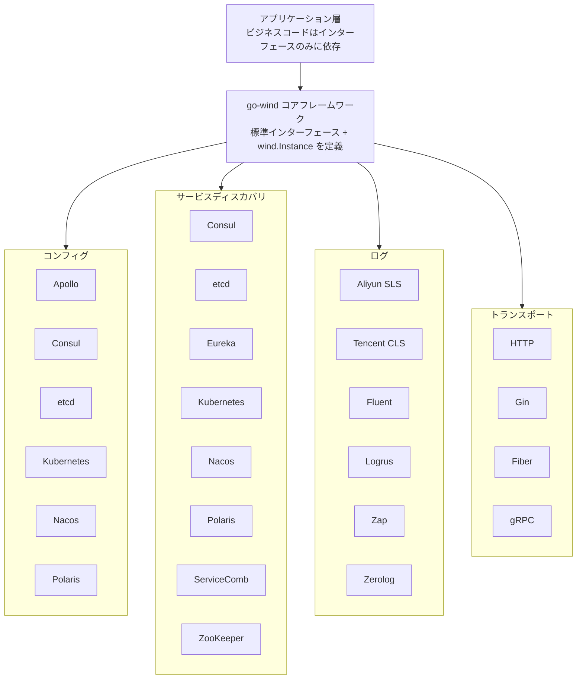

<p align="center">
  <h1 align="center">Go Wind Plugins · 風行プラグインライブラリ</h1>
  <p align="center">
    Go Wind マイクロサービスフレームワークのマルチエンジンプラグインエコシステム
  </p>
  <p align="center">
    <em>一つのインターフェース、複数のエンジン、必要に応じて組み合わせ、プラグ＆プレイ</em>
  </p>
</p>

<p align="center">
  <a href="README.md">中文</a> · <a href="README_en.md">English</a> · <a href="README_ja.md">日本語</a>
</p>

<p align="center">
  
  
  
  
</p>

---

## プロジェクト概要

**go-wind-plugins** は [go-wind](https://github.com/tx7do/go-wind) マイクロサービスフレームワークの公式プラグインライブラリです。コンフィグセンター、サービスディスカバリ、ロギングシステム、トランスポート層に対して、統一された抽象インターフェースとマルチエンジン実装を提供します。

**レゴのような組み合わせ設計**を採用——各プラグインはコアフレームワークが定義する標準インターフェースのみを実装します。実際の技術スタックに応じて基盤エンジンを自由に選択でき、エンジン切替時にビジネスコードの変更は不要です。

---

## 主な特徴

- **統一インターフェース**：4つのドメイン（Config / Registry / Log / Transport）いずれもコアフレームワークが標準インターフェースを定義
- **マルチエンジンサポート**：6種類のコンフィグセンター、8種類のレジストリ、6種類のログバックエンド、3種類のHTTPドライバ
- **ゼロ侵入**：ビジネスコードはインターフェースのみに依存し、特定エンジンのSDKには依存しない
- **独立バージョン管理**：各サブモジュールが独自の `go.mod` を持ち、必要なものだけを導入可能
- **Workspace連携**：`go.work` によるマルチモジュール管理で、単一リポジトリのような開発体験

---

## コアインターフェース

### コンフィグ（Config）

| インターフェース | メソッド | 説明 |
|-----------------|---------|------|
| `Reader` | `Load(ctx, key) ([]byte, error)` | keyによる一回限りのコンフィグ読み込み |
| `Watcher` | `Watch(ctx, key) (<-chan struct{}, error)` | 信号モード、値変更時に通知 |
| `ValueWatcher` | `WatchValue(ctx, key) (<-chan []byte, error)` | プッシュモード、新しい値を直接配信 |
| `Closer` | `Close() error` | リソース解放 |
| `Decoder` | `Decode(data, out) error` | 生バイトからのデシリアライズ |

### サービスディスカバリ（Registry）

| インターフェース | メソッド | 説明 |
|-----------------|---------|------|
| `Registrar` | `Register(ctx, *Instance)` / `Deregister(ctx, *Instance)` | サービス登録・登録解除 |
| `Discovery` | `GetService(ctx, name)` / `Watch(ctx, name)` | サービス発見・監視 |
| `Watcher` | `Next(ctx) ([]*Instance, error)` / `Stop()` | インスタンス変更ストリーム |

### ログ（Log）

| インターフェース | メソッド | 説明 |
|-----------------|---------|------|
| `Logger` | `Debug/Info/Warn/Error(ctx, msg, keyvals...)` | 4レベルログ出力 |
| `Logger` | `With(keyvals...) Logger` | コンテキストフィールドの付与 |
| `Logger` | `Enabled(Level) bool` | レベル判定 |

### トランスポート（Transport）

| インターフェース | メソッド | 説明 |
|-----------------|---------|------|
| `Server` (HTTP) | `Handle / GET / POST / PUT / DELETE...` | ルーティング登録 |
| `Server` (HTTP) | `Start(ctx)` / `Stop(ctx)` / `Endpoint()` | ライフサイクル管理 |
| `Driver` (HTTP) | `Handle / Start / Stop` | フレームワークアダプタドライバ |

---

## プラグイン一覧

### コンフィグ（Config）

| プラグイン | モジュールパス | エンジン |
|-----------|--------------|---------|
| Apollo | `github.com/tx7do/go-wind-plugins/config/apollo` | Ctrip Apollo |
| Consul | `github.com/tx7do/go-wind-plugins/config/consul` | HashiCorp Consul KV |
| Etcd | `github.com/tx7do/go-wind-plugins/config/etcd` | CoreOS etcd |
| Kubernetes | `github.com/tx7do/go-wind-plugins/config/kubernetes` | K8s ConfigMap / Secret |
| Nacos | `github.com/tx7do/go-wind-plugins/config/nacos` | Alibaba Nacos |
| Polaris | `github.com/tx7do/go-wind-plugins/config/polaris` | Tencent Polaris |

### サービスディスカバリ（Registry）

| プラグイン | モジュールパス | エンジン |
|-----------|--------------|---------|
| Consul | `github.com/tx7do/go-wind-plugins/registry/consul` | HashiCorp Consul |
| Etcd | `github.com/tx7do/go-wind-plugins/registry/etcd` | CoreOS etcd |
| Eureka | `github.com/tx7do/go-wind-plugins/registry/eureka` | Netflix Eureka |
| Kubernetes | `github.com/tx7do/go-wind-plugins/registry/kubernetes` | K8s Endpoints |
| Nacos | `github.com/tx7do/go-wind-plugins/registry/nacos` | Alibaba Nacos |
| Polaris | `github.com/tx7do/go-wind-plugins/registry/polaris` | Tencent Polaris |
| ServiceComb | `github.com/tx7do/go-wind-plugins/registry/servicecomb` | Apache ServiceComb |
| Zookeeper | `github.com/tx7do/go-wind-plugins/registry/zookeeper` | Apache ZooKeeper |

### ログ（Log）

| プラグイン | モジュールパス | エンジン |
|-----------|--------------|---------|
| Aliyun SLS | `github.com/tx7do/go-wind-plugins/log/aliyun` | Alibaba Cloud SLS |
| Tencent CLS | `github.com/tx7do/go-wind-plugins/log/tencent` | Tencent Cloud CLS |
| Fluent | `github.com/tx7do/go-wind-plugins/log/fluent` | Fluentd |
| Logrus | `github.com/tx7do/go-wind-plugins/log/logrus` | sirupsen/logrus |
| Zap | `github.com/tx7do/go-wind-plugins/log/zap` | uber-go/zap |
| Zerolog | `github.com/tx7do/go-wind-plugins/log/zerolog` | rs/zerolog |

### トランスポート（Transport）

| プラグイン | モジュールパス | エンジン |
|-----------|--------------|---------|
| HTTP（標準ライブラリ） | `github.com/tx7do/go-wind-plugins/transport/http` | net/http |
| HTTP（Gin） | `github.com/tx7do/go-wind-plugins/transport/http/gin` | gin-gonic/gin |
| HTTP（Fiber） | `github.com/tx7do/go-wind-plugins/transport/http/fiber` | gofiber/fiber |
| gRPC | `github.com/tx7do/go-wind-plugins/transport/grpc` | google.golang.org/grpc |

---

## アーキテクチャ



---

## プロジェクト構成

```
go-wind-plugins/
├── config/                         # コンフィグセンターインターフェースとプラグイン
│   ├── config.go                   # 標準インターフェース定義（Reader/Watcher/ValueWatcher...）
│   ├── go.mod
│   ├── apollo/                     # Ctrip Apollo
│   ├── consul/                     # HashiCorp Consul KV
│   ├── etcd/                       # CoreOS etcd
│   ├── kubernetes/                 # Kubernetes ConfigMap/Secret
│   ├── nacos/                      # Alibaba Nacos
│   └── polaris/                    # Tencent Polaris
│
├── registry/                       # サービスディスカバリインターフェースとプラグイン
│   ├── registrar.go                # Registrar インターフェース
│   ├── discovery.go                # Discovery / Watcher インターフェース
│   ├── go.mod
│   ├── consul/                     # HashiCorp Consul
│   ├── etcd/                       # CoreOS etcd
│   ├── eureka/                     # Netflix Eureka
│   ├── kubernetes/                 # Kubernetes Endpoints
│   ├── nacos/                      # Alibaba Nacos
│   ├── polaris/                    # Tencent Polaris
│   ├── servicecomb/                # Apache ServiceComb
│   └── zookeeper/                  # Apache ZooKeeper
│
├── log/                            # ログインターフェースとアダプタ
│   ├── slog_logger.go              # 標準ライブラリ slog アダプタ（デフォルト実装）
│   ├── level_filter.go             # レベルフィルタ
│   ├── multi_logger.go             # マルチロガー
│   ├── go.mod
│   ├── aliyun/                     # Alibaba Cloud SLS
│   ├── fluent/                     # Fluentd
│   ├── logrus/                     # sirupsen/logrus
│   ├── tencent/                    # Tencent Cloud CLS
│   ├── zap/                        # uber-go/zap
│   └── zerolog/                    # rs/zerolog
│
├── transport/                      # トランスポート層インターフェースとドライバ
│   ├── http/                       # HTTP Server + Driver インターフェース + デフォルトドライバ
│   │   ├── server.go               # Server 実装（ルーティング/ミドルウェア/TLS）
│   │   ├── default_server.go       # 標準ライブラリベースのデフォルトドライバ
│   │   ├── options.go              # 設定オプション
│   │   ├── gin/                    # Gin ドライバ
│   │   └── fiber/                  # Fiber ドライバ
│   └── grpc/                       # gRPC Server
│
├── go.work                         # Go Workspace マルチモジュール管理
├── LICENSE
└── README.md
```

---

## クイックスタート

### インストール

```bash
# 必要なものだけを導入、例：etcdコンフィグ + nacosレジストリ
go get github.com/tx7do/go-wind-plugins/config/etcd
go get github.com/tx7do/go-wind-plugins/registry/nacos
go get github.com/tx7do/go-wind-plugins/log/zap
```

### コンフィグ例（etcd）

```go
package main

import (
    "context"
    "fmt"

    clientv3 "go.etcd.io/etcd/client/v3"

    "github.com/tx7do/go-wind-plugins/config/etcd"
)

func main() {
    client, err := clientv3.New(clientv3.Config{
        Endpoints: []string{"localhost:2379"},
    })
    if err != nil {
        panic(err)
    }

    cfg, err := etcd.New(client)
    if err != nil {
        panic(err)
    }

    // コンフィグ読み込み
    data, err := cfg.Load(context.Background(), "/myapp/config")
    if err != nil {
        panic(err)
    }
    fmt.Println("config:", string(data))

    // コンフィグ変更の監視
    ch, _ := cfg.WatchValue(context.Background(), "/myapp/config")
    for val := range ch {
        fmt.Println("config updated:", string(val))
    }
}
```

### サービスディスカバリ例（nacos）

```go
package main

import (
    "context"
    "fmt"

    "github.com/nacos-group/nacos-sdk-go/v2/clients"
    "github.com/nacos-group/nacos-sdk-go/v2/common/constant"
    "github.com/nacos-group/nacos-sdk-go/v2/vo"
    wind "github.com/tx7do/go-wind"

    "github.com/tx7do/go-wind-plugins/registry/nacos"
)

func main() {
    client, _ := clients.NewNamingClient(vo.NacosClientParam{
        ServerConfigs: []constant.ServerConfig{
            {IpAddr: "127.0.0.1", Port: 8848},
        },
        ClientConfig: &constant.ClientConfig{
            NamespaceId: "public",
        },
    })

    r := nacos.New(client)

    // サービス登録
    instance := &wind.Instance{
        Name:      "my-service",
        Version:   "v1.0.0",
        Endpoints: []string{"grpc://127.0.0.1:8080"},
    }
    _ = r.Register(context.Background(), instance)

    // サービス発見
    services, _ := r.GetService(context.Background(), "my-service.grpc")
    for _, svc := range services {
        fmt.Printf("found: %+v\n", svc)
    }
}
```

### HTTPサーバー例（Ginドライバ）

```go
package main

import (
    "context"
    "net/http"

    httpPlugin "github.com/tx7do/go-wind-plugins/transport/http"
    "github.com/tx7do/go-wind-plugins/transport/http/gin"
)

func main() {
    srv := httpPlugin.NewServer(":8080",
        httpPlugin.WithDriver(gin.NewDriver()),
        httpPlugin.WithMiddleware(func(next http.Handler) http.Handler {
            return http.HandlerFunc(func(w http.ResponseWriter, r *http.Request) {
                w.Header().Set("X-Engine", "gin")
                next.ServeHTTP(w, r)
            })
        }),
    )

    srv.GET("/", func(w http.ResponseWriter, r *http.Request) {
        w.Write([]byte("Hello from Gin driver!"))
    })

    srv.Start(context.Background())
}
```

### ログ例（Zap）

```go
package main

import (
    "context"
    "github.com/tx7do/go-wind-plugins/log/zap"
)

func main() {
    logger, _ := zap.NewZapLogger()
    logger.Info(context.Background(), "service started", "port", 8080)
    logger.With("module", "auth").Error(context.Background(), "token expired")
}
```

---

## 設計理念

### レゴスタイルの組み合わせ

go-wind-plugins は **インターフェース優先、実装はオプション** の設計原則に従います：

1. **コアフレームワークがインターフェースを定義**：`go-wind` が `Reader`、`Registrar`、`Logger`、`Server` などの標準インターフェースを定義
2. **プラグインがインターフェースを実装**：各プラグインモジュールは対応する標準インターフェースのみを実装
3. **アプリケーション層での注入**：ビジネスコードはインターフェース経由でプラグインを参照し、エンジン切替はインポートの変更のみ

### 独立バージョン管理

各サブモジュールは独自の `go.mod` を持ち、独立してバージョン管理が可能です：

```
github.com/tx7do/go-wind-plugins/config        # インターフェース定義
github.com/tx7do/go-wind-plugins/config/etcd    # etcd 実装
github.com/tx7do/go-wind-plugins/registry       # インターフェース定義
github.com/tx7do/go-wind-plugins/registry/nacos # nacos 実装
```

---

## コントリビュート

Issue と Pull Request を歓迎します！

1. このリポジトリを Fork
2. フィーチャーブランチを作成：`git checkout -b feature/new-plugin`
3. 変更をコミット：`git commit -m 'feat: add new plugin'`
4. ブランチをプッシュ：`git push origin feature/new-plugin`
5. Pull Request を送信

---

## ライセンス

[MIT License](LICENSE) © 2026 GoWind
