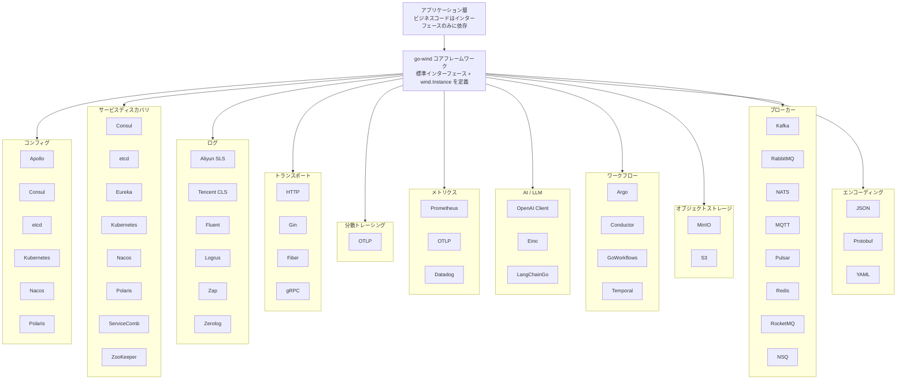

<p align="center">
  <h1 align="center">Go Wind Plugins · 風行プラグインライブラリ</h1>
  <p align="center">
    Go Wind マイクロサービスフレームワークのマルチエンジンプラグインエコシステム
  </p>
  <p align="center">
    <em>一つのインターフェース、複数のエンジン、必要に応じて組み合わせ、プラグ＆プレイ</em>
  </p>
</p>

<p align="center">
  <a href="README.md">中文</a> · <a href="README_en.md">English</a> · <a href="README_ja.md">日本語</a>
</p>

<p align="center">
  
  
  
  
</p>

---

## プロジェクト概要

**go-wind-plugins** は [go-wind](https://github.com/tx7do/go-wind) マイクロサービスフレームワークの公式プラグインライブラリです。コンフィグセンター、サービスディスカバリ、ロギングシステム、トランスポート層に対して、統一された抽象インターフェースとマルチエンジン実装を提供します。

**レゴのような組み合わせ設計**を採用——各プラグインはコアフレームワークが定義する標準インターフェースのみを実装します。実際の技術スタックに応じて基盤エンジンを自由に選択でき、エンジン切替時にビジネスコードの変更は不要です。

---

## 主な特徴
- **統一インターフェース**：6つのドメイン（Config / Registry / Log / Metrics / Transport / Tracer）いずれもコアフレームワークが標準インターフェースを定義
- **マルチエンジンサポート**：6種類のコンフィグセンター、8種類のレジストリ、6種類のログバックエンド、3種類のメトリクスバックエンド、3種類のHTTPドライバ、1種類のOTLPトレースプロトコル、12種類のメッセージブローカー
- **ゼロ侵入**：ビジネスコードはインターフェースのみに依存し、特定エンジンのSDKには依存しない
- **独立バージョン管理**：各サブモジュールが独自の `go.mod` を持ち、必要なものだけを導入可能
- **Workspace連携**：`go.work` によるマルチモジュール管理で、単一リポジトリのような開発体験

---

## コアインターフェース

### コンフィグ（Config）

| インターフェース | メソッド | 説明 |
|-----------------|---------|------|
| `Reader` | `Load(ctx, key) ([]byte, error)` | keyによる一回限りのコンフィグ読み込み |
| `Watcher` | `Watch(ctx, key) (<-chan struct{}, error)` | 信号モード、値変更時に通知 |
| `ValueWatcher` | `WatchValue(ctx, key) (<-chan []byte, error)` | プッシュモード、新しい値を直接配信 |
| `Closer` | `Close() error` | リソース解放 |
| `Decoder` | `Decode(data, out) error` | 生バイトからのデシリアライズ |

### サービスディスカバリ（Registry）

| インターフェース | メソッド | 説明 |
|-----------------|---------|------|
| `Registrar` | `Register(ctx, *Instance)` / `Deregister(ctx, *Instance)` | サービス登録・登録解除 |
| `Discovery` | `GetService(ctx, name)` / `Watch(ctx, name)` | サービス発見・監視 |
| `Watcher` | `Next(ctx) ([]*Instance, error)` / `Stop()` | インスタンス変更ストリーム |

### ログ（Log）

| インターフェース | メソッド | 説明 |
|-----------------|---------|------|
| `Logger` | `Debug/Info/Warn/Error(ctx, msg, keyvals...)` | 4レベルログ出力 |
| `Logger` | `With(keyvals...) Logger` | コンテキストフィールドの付与 |
| `Logger` | `Enabled(Level) bool` | レベル判定 |

### トランスポート（Transport）

| インターフェース | メソッド | 説明 |
|-----------------|---------|------|
| `Server` (HTTP) | `Handle / GET / POST / PUT / DELETE...` | ルーティング登録 |
| `Server` (HTTP) | `Start(ctx)` / `Stop(ctx)` / `Endpoint()` | ライフサイクル管理 |
| `Driver` (HTTP) | `Handle / Start / Stop` | フレームワークアダプタドライバ |

### 分散トレーシング（Tracer）

| インターフェース | メソッド | 説明 |
|-----------------|---------|------|
| `*sdktrace.TracerProvider` | `Tracer(name) trace.Tracer` | 標準 OTel Tracer を作成 |
| `*sdktrace.TracerProvider` | `Shutdown(ctx)` | プロバイダーをシャットダウンし、保留中の Span をフラッシュ |
| `trace.Tracer` | `Start(ctx, name, opts...)` | Span を作成し、トレースコンテキストを注入 |

> OpenTelemetry 標準に基づき、カスタムインターフェースは定義せず、ネイティブ OTel 型を直接使用します。

### メトリクス（Metrics）

| インターフェース | メソッド | 説明 |
|-----------------|---------|------|
| `Metrics` | `Counter(ctx, name, value, labels)` | 単調増加カウンター（要求数、エラー数） |
| `Metrics` | `Histogram(ctx, name, value, labels)` | ヒストグラム分布（レイテンシ、ペイロードサイズ） |
| `Metrics` | `Gauge(ctx, name, value, labels)` | 現在の瞬間値（キューサイズ、アクティブ接続数） |
| `Closer` | `Close() error` | クローズして保留中のデータをフラッシュ |

### ブローカー（Broker）

| インターフェース | メソッド | 説明 |
|------|------|------|
| `Broker` | `Name() string` | ブローカー名の取得 |
| `Broker` | `Address() string` | ブローカーアドレスの取得 |
| `Broker` | `Init(...Option) error` | ブローカーの初期化 |
| `Broker` | `Connect() / Disconnect() error` | 接続 / 切断 |
| `Broker` | `Publish(ctx, topic, *Message, ...PublishOption) error` | トピックにメッセージを公開 |
| `Broker` | `Subscribe(topic, Handler, Binder, ...SubscribeOption) (Subscriber, error)` | トピックを購読 |
| `Broker` | `Request(ctx, topic, *Message, ...RequestOption) (*Message, error)` | リクエスト-レスポンスパターン |
| `Message` | `Headers / Body / Key` | メッセージヘッダー、本文、パーティションキー |
| `Event` | `Topic() / Message() / Ack() / Error()` | サブスクライバーが受信したイベント |
| `Subscriber` | `Unsubscribe() error` | 購読解除 |

### AI / LLM

> 3つのフレームワークは戻り値の型が互換性がないため、抽象インターフェースは定義せず、共有設定型 `ai.Config` のみを提供します。
>
> 各プラグインのコンストラクタはフレームワークのネイティブ型を直接返します。

| 入力 | コンストラクタ | 戻り値 |
|------|-------------|--------|
| `ai.Config` | `model.NewClient(cfg)` | `*openai.Client` |
| `ai.Config` | `eino.NewChatModel(ctx, cfg)` | `model.ChatModel` (Eino インターフェース) |
| `ai.Config` | `langchaingo.NewModel(cfg)` | `llms.Model` (LangChainGo インターフェース) |

### エンコーディング（Encoding）

| インターフェース/関数 | メソッド | 説明 |
|------|------|------|
| `Codec` | `Marshal(v) ([]byte, error)` | シリアライズ |
| `Codec` | `Unmarshal(data, v) error` | デシリアライズ |
| `Codec` | `Name() string` | コーデック名（json/proto/yaml） |
| パッケージ関数 | `RegisterCodec(c)` / `GetCodec(name)` | グローバルレジストリ |

---

## プラグイン一覧

### コンフィグ（Config）

| プラグイン | モジュールパス | エンジン |
|-----------|--------------|---------|
| Apollo | `github.com/tx7do/go-wind-plugins/config/apollo` | Ctrip Apollo |
| Consul | `github.com/tx7do/go-wind-plugins/config/consul` | HashiCorp Consul KV |
| Etcd | `github.com/tx7do/go-wind-plugins/config/etcd` | CoreOS etcd |
| Kubernetes | `github.com/tx7do/go-wind-plugins/config/kubernetes` | K8s ConfigMap / Secret |
| Nacos | `github.com/tx7do/go-wind-plugins/config/nacos` | Alibaba Nacos |
| Polaris | `github.com/tx7do/go-wind-plugins/config/polaris` | Tencent Polaris |

### サービスディスカバリ（Registry）

| プラグイン | モジュールパス | エンジン |
|-----------|--------------|---------|
| Consul | `github.com/tx7do/go-wind-plugins/registry/consul` | HashiCorp Consul |
| Etcd | `github.com/tx7do/go-wind-plugins/registry/etcd` | CoreOS etcd |
| Eureka | `github.com/tx7do/go-wind-plugins/registry/eureka` | Netflix Eureka |
| Kubernetes | `github.com/tx7do/go-wind-plugins/registry/kubernetes` | K8s Endpoints |
| Nacos | `github.com/tx7do/go-wind-plugins/registry/nacos` | Alibaba Nacos |
| Polaris | `github.com/tx7do/go-wind-plugins/registry/polaris` | Tencent Polaris |
| ServiceComb | `github.com/tx7do/go-wind-plugins/registry/servicecomb` | Apache ServiceComb |
| Zookeeper | `github.com/tx7do/go-wind-plugins/registry/zookeeper` | Apache ZooKeeper |

### ログ（Log）

| プラグイン | モジュールパス | エンジン |
|-----------|--------------|---------|
| Aliyun SLS | `github.com/tx7do/go-wind-plugins/log/aliyun` | Alibaba Cloud SLS |
| Tencent CLS | `github.com/tx7do/go-wind-plugins/log/tencent` | Tencent Cloud CLS |
| Fluent | `github.com/tx7do/go-wind-plugins/log/fluent` | Fluentd |
| Logrus | `github.com/tx7do/go-wind-plugins/log/logrus` | sirupsen/logrus |
| Zap | `github.com/tx7do/go-wind-plugins/log/zap` | uber-go/zap |
| Zerolog | `github.com/tx7do/go-wind-plugins/log/zerolog` | rs/zerolog |

### トランスポート（Transport）

| プラグイン | モジュールパス | エンジン |
|-----------|--------------|--------|
| HTTP（標準ライブラリ） | `github.com/tx7do/go-wind-plugins/transport/http` | net/http |
| HTTP（Gin） | `github.com/tx7do/go-wind-plugins/transport/http/gin` | gin-gonic/gin |
| HTTP（Fiber） | `github.com/tx7do/go-wind-plugins/transport/http/fiber` | gofiber/fiber |
| gRPC | `github.com/tx7do/go-wind-plugins/transport/grpc` | google.golang.org/grpc |

### 分散トレーシング（Tracer）

| プラグイン | モジュールパス | エンジン |
|-----------|--------------|--------|
| OTLP | `github.com/tx7do/go-wind-plugins/tracer/otlp` | OpenTelemetry Protocol (OTLP) |

**説明**：OTLPはOpenTelemetryの標準プロトコルであり、Jaeger、Zipkin、SkyWalking、Tempo (Grafana)、Datadog、Alibaba Cloud ARMS、Tencent Cloud APMなど、すべての主要なバックエンドに対応しています。エンドポイントを設定するだけでバックエンドを切り替えられ、プラグインを変更する必要はありません。

### メトリクス（Metrics）

| プラグイン | モジュールパス | エンジン |
|-----------|--------------|--------|
| Prometheus | `github.com/tx7do/go-wind-plugins/metrics/prometheus` | Prometheus client_golang |
| OpenTelemetry | `github.com/tx7do/go-wind-plugins/metrics/otel` | OTLP (gRPC/HTTP) |
| Datadog | `github.com/tx7do/go-wind-plugins/metrics/datadog` | DogStatsD |

### AI / LLM

| プラグイン | モジュールパス | フレームワーク |
|-----------|--------------|---------------|
| OpenAI Client | `github.com/tx7do/go-wind-plugins/ai/openai` | sashabaranov/go-openai |
| Eino | `github.com/tx7do/go-wind-plugins/ai/eino` | cloudwego/eino |
| LangChainGo | `github.com/tx7do/go-wind-plugins/ai/langchaingo` | tmc/langchaingo |

### エンコーディング（Encoding）

| プラグイン | モジュールパス | エンジン |
|-----------|--------------|--------|
| JSON | `github.com/tx7do/go-wind-plugins/encoding/json` | encoding/json |
| Protobuf | `github.com/tx7do/go-wind-plugins/encoding/proto` | google.golang.org/protobuf |
| YAML | `github.com/tx7do/go-wind-plugins/encoding/yaml` | gopkg.in/yaml.v3 |

### ワークフロー

> 4つのエンジンはワークフロー操作のパラメータ/戻り値型が互換性がありません。最小限の共通インターフェース `workflow.Client`（`Close() error`）のみ抽出します。

| プラグイン | モジュールパス | フレームワーク |
|-----------|--------------|---------------|
| Argo Workflows | `github.com/tx7do/go-wind-plugins/workflow/argo` | Argo Workflows REST API |
| Conductor | `github.com/tx7do/go-wind-plugins/workflow/conductor` | conductor-sdk/conductor-go |
| GoWorkflows | `github.com/tx7do/go-wind-plugins/workflow/goworkflows` | cschleiden/go-workflows |
| Temporal | `github.com/tx7do/go-wind-plugins/workflow/temporal` | temporal.io/sdk |

### オブジェクトストレージ

> 2つの OSS 実装は基盤 SDK と戻り値型が互換性がありません。それぞれがローカル `Config` を定義し、共通インターフェースは抽出しません。

| プラグイン | モジュールパス | フレームワーク |
|-----------|--------------|---------------|
| MinIO | `github.com/tx7do/go-wind-plugins/oss/minio` | minio/minio-go |
| S3 | `github.com/tx7do/go-wind-plugins/oss/s3` | aws/aws-sdk-go-v2 |

### ブローカー（Broker）

> 各ブローカーエンジンはSDKの差が大きく、各サブモジュールが独自の設定オプションを定義しますが、コア `broker.Broker` インターフェースを実装します。

| プラグイン | モジュールパス | エンジン |
|-----------|--------------|--------|
| Kafka | `github.com/tx7do/go-wind-plugins/broker/kafka` | segmentio/kafka-go |
| RabbitMQ | `github.com/tx7do/go-wind-plugins/broker/rabbitmq` | rabbitmq/amqp091-go |
| NATS | `github.com/tx7do/go-wind-plugins/broker/nats` | nats-io/nats.go |
| MQTT | `github.com/tx7do/go-wind-plugins/broker/mqtt` | eclipse/paho.mqtt.golang |
| Pulsar | `github.com/tx7do/go-wind-plugins/broker/pulsar` | apache/pulsar-client-go |
| Redis | `github.com/tx7do/go-wind-plugins/broker/redis` | gomodule/redigo |
| RocketMQ | `github.com/tx7do/go-wind-plugins/broker/rocketmq` | apache/rocketmq-client-go + rocketmq-clients |
| NSQ | `github.com/tx7do/go-wind-plugins/broker/nsq` | nsqio/go-nsq |
| SQS | `github.com/tx7do/go-wind-plugins/broker/sqs` | aws/aws-sdk-go-v2 |
| GCP PubSub | `github.com/tx7do/go-wind-plugins/broker/gcpubsub` | cloud.google.com/go/pubsub |
| Azure Service Bus | `github.com/tx7do/go-wind-plugins/broker/azuresb` | azure-sdk-for-go |
| STOMP | `github.com/tx7do/go-wind-plugins/broker/stomp` | go-stomp/stomp |

---

## アーキテクチャ



---

## プロジェクト構成

```
go-wind-plugins/
├── config/                         # コンフィグセンターインターフェースとプラグイン
│   ├── config.go                   # 標準インターフェース定義（Reader/Watcher/ValueWatcher...）
│   ├── go.mod
│   ├── apollo/                     # Ctrip Apollo
│   ├── consul/                     # HashiCorp Consul KV
│   ├── etcd/                       # CoreOS etcd
│   ├── kubernetes/                 # Kubernetes ConfigMap/Secret
│   ├── nacos/                      # Alibaba Nacos
│   └── polaris/                    # Tencent Polaris
│
├── registry/                       # サービスディスカバリインターフェースとプラグイン
│   ├── registrar.go                # Registrar インターフェース
│   ├── discovery.go                # Discovery / Watcher インターフェース
│   ├── go.mod
│   ├── consul/                     # HashiCorp Consul
│   ├── etcd/                       # CoreOS etcd
│   ├── eureka/                     # Netflix Eureka
│   ├── kubernetes/                 # Kubernetes Endpoints
│   ├── nacos/                      # Alibaba Nacos
│   ├── polaris/                    # Tencent Polaris
│   ├── servicecomb/                # Apache ServiceComb
│   └── zookeeper/                  # Apache ZooKeeper
│
├── log/                            # ログインターフェースとアダプタ
│   ├── slog_logger.go              # 標準ライブラリ slog アダプタ（デフォルト実装）
│   ├── level_filter.go             # レベルフィルタ
│   ├── multi_logger.go             # マルチロガー
│   ├── go.mod
│   ├── aliyun/                     # Alibaba Cloud SLS
│   ├── fluent/                     # Fluentd
│   ├── logrus/                     # sirupsen/logrus
│   ├── tencent/                    # Tencent Cloud CLS
│   ├── zap/                        # uber-go/zap
│   └── zerolog/                    # rs/zerolog
│
├── transport/                      # トランスポート層インターフェースとドライバ
│   ├── http/                       # HTTP Server + Driver インターフェース + デフォルトドライバ
│   │   ├── server.go               # Server 実装（ルーティング/ミドルウェア/TLS）
│   │   ├── default_server.go       # 標準ライブラリベースのデフォルトドライバ
│   │   ├── options.go              # 設定オプション
│   │   ├── gin/                    # Gin ドライバ
│   │   └── fiber/                  # Fiber ドライバ
│   └── grpc/                       # gRPC Server
│
├── tracer/                         # 分散トレーシングプラグイン
│   ├── tracer.go                   # パッケージドキュメント
│   ├── go.mod
│   └── otlp/                       # OpenTelemetry Protocol (OTLP) 実装
│       ├── otlp.go                 # ネイティブ *sdktrace.TracerProvider を返す
│       └── go.mod
│
├── metrics/                        # メトリクスインターフェースとプラグイン
│   ├── metrics.go                  # Metrics インターフェース定義（Counter/Histogram/Gauge）
│   ├── doc.go                      # パッケージドキュメント
│   ├── go.mod
│   ├── prometheus/                 # Prometheus client_golang 実装
│   │   ├── prometheus.go           # Prometheus provider 実装
│   │   └── go.mod
│   ├── otel/                       # OpenTelemetry OTLP 実装
│   │   ├── otel.go                 # OTLP metric exporter 設定
│   │   └── go.mod
│   └── datadog/                    # Datadog DogStatsD 実装
│       ├── datadog.go              # DogStatsD provider 実装
│       └── go.mod
│
├── ai/                             # AI / LLM プラグイン（独立した自己完結モジュール）
│   ├── openai/                     # OpenAI 互換クライアント（sashabaranov/go-openai）
│   │   ├── client.go               # *openai.Client を返す
│   │   ├── config.go               # ローカル Config 型
│   │   ├── options.go              # HTTP クライアントオプション
│   │   └── go.mod
│   ├── eino/                       # ByteDance Eino フレームワーク（cloudwego/eino）
│   │   ├── client.go               # model.ChatModel を返す
│   │   ├── config.go               # ローカル Config 型
│   │   ├── compose.go              # Chain/Graph/Workflow ヘルパー
│   │   ├── chain.go                # Chain ノード追加メソッド
│   │   ├── prompt.go               # ChatTemplate ヘルパー
│   │   ├── tool.go                 # Tool ノードヘルパー
│   │   ├── options.go              # ChatModel 設定モディファイア
│   │   └── go.mod
│   └── langchaingo/                # LangChainGo（tmc/langchaingo）
│       ├── client.go               # llms.Model を返す
│       ├── config.go               # ローカル Config 型
│       ├── agent.go                # Agent / Executor ヘルパー
│       ├── chain.go                # Chain ヘルパー
│       ├── memory.go               # Memory ヘルパー
│       ├── embedding.go            # Embedding ヘルパー
│       ├── vectorstore.go          # VectorStore ヘルパー
│       ├── options.go              # OpenAI/Ollama/HTTP オプション
│       └── go.mod
│
├── workflow/                      # ワークフローエンジンプラグイン（Client/Worker 共通インターフェース定義）
│   ├── workflow.go                # 共通インターフェース（Client/Worker）
│   ├── go.mod
│   ├── argo/                      # Argo Workflows（REST API）
│   │   ├── client.go              # 送信/取得/一時停止/再開/終了
│   │   ├── options.go             # 設定オプション + Argo 型定義
│   │   ├── logger.go              # slog ログラッパー
│   │   └── go.mod
│   ├── conductor/                 # Netflix Conductor（conductor-go SDK）
│   │   ├── client.go              # 開始/取得/一時停止/再開/終了
│   │   ├── worker.go              # Task Worker
│   │   ├── options.go             # 設定オプション
│   │   ├── logger.go
│   │   └── go.mod
│   ├── goworkflows/               # cschleiden/go-workflows
│   │   ├── client.go              # 作成/キャンセル/シグナル/待機
│   │   ├── worker.go              # Workflow + Activity Worker
│   │   ├── options.go             # Worker オプション
│   │   ├── logger.go
│   │   └── go.mod
│   └── temporal/                  # Temporal（temporal.io/sdk）
│       ├── client.go              # 実行/シグナル/クエリ/キャンセル（ネイティブ OTel トレーシング）
│       ├── worker.go              # Worker + 組み込みメッセージ処理 Activity
│       ├── workflow.go            # 組み込み BrokerMessageWorkflow
│       ├── options.go             # 設定オプション
│       ├── logger.go
│       └── go.mod
│
├── encoding/                      # エンコーディングインターフェースとプラグイン
│   ├── encoding.go                # Codec インターフェース定義 + レジストリ
│   ├── go.mod
│   ├── json/                      # JSON コーデック（encoding/json）
│   │   ├── json.go
│   │   └── go.mod
│   ├── proto/                     # Protobuf コーデック（google.golang.org/protobuf）
│   │   ├── proto.go
│   │   └── go.mod
│   └── yaml/                      # YAML コーデック（gopkg.in/yaml.v3）
│       ├── yaml.go
│       └── go.mod
│
├── oss/                           # オブジェクトストレージプラグイン（自己完結型設定）
│   ├── minio/                     # MinIO（minio/minio-go）
│   │   ├── client.go              # *minio.Client を返す
│   │   ├── config.go              # ローカル Config 型
│   │   └── go.mod
│   └── s3/                        # AWS S3 互換（aws-sdk-go-v2）
│       ├── client.go              # *s3.Client を返す
│       ├── storage.go             # Storage ラッパー（デフォルト bucket）
│       ├── config.go              # ローカル Config 型
│       ├── errors.go              # センチネルエラー
│       └── go.mod
│
├── go.work                         # Go Workspace マルチモジュール管理
├── LICENSE
└── README.md
```

---

## クイックスタート

### インストール

```bash
# 必要なものだけを導入、例：etcdコンフィグ + nacosレジストリ
go get github.com/tx7do/go-wind-plugins/config/etcd
go get github.com/tx7do/go-wind-plugins/registry/nacos
go get github.com/tx7do/go-wind-plugins/log/zap
```

### コンフィグ例（etcd）

```go
package main

import (
    "context"
    "fmt"

    clientv3 "go.etcd.io/etcd/client/v3"

    "github.com/tx7do/go-wind-plugins/config/etcd"
)

func main() {
    client, err := clientv3.New(clientv3.Config{
        Endpoints: []string{"localhost:2379"},
    })
    if err != nil {
        panic(err)
    }

    cfg, err := etcd.New(client)
    if err != nil {
        panic(err)
    }

    // コンフィグ読み込み
    data, err := cfg.Load(context.Background(), "/myapp/config")
    if err != nil {
        panic(err)
    }
    fmt.Println("config:", string(data))

    // コンフィグ変更の監視
    ch, _ := cfg.WatchValue(context.Background(), "/myapp/config")
    for val := range ch {
        fmt.Println("config updated:", string(val))
    }
}
```

### サービスディスカバリ例（nacos）

```go
package main

import (
    "context"
    "fmt"

    "github.com/nacos-group/nacos-sdk-go/v2/clients"
    "github.com/nacos-group/nacos-sdk-go/v2/common/constant"
    "github.com/nacos-group/nacos-sdk-go/v2/vo"
    wind "github.com/tx7do/go-wind"

    "github.com/tx7do/go-wind-plugins/registry/nacos"
)

func main() {
    client, _ := clients.NewNamingClient(vo.NacosClientParam{
        ServerConfigs: []constant.ServerConfig{
            {IpAddr: "127.0.0.1", Port: 8848},
        },
        ClientConfig: &constant.ClientConfig{
            NamespaceId: "public",
        },
    })

    r := nacos.New(client)

    // サービス登録
    instance := &wind.Instance{
        Name:      "my-service",
        Version:   "v1.0.0",
        Endpoints: []string{"grpc://127.0.0.1:8080"},
    }
    _ = r.Register(context.Background(), instance)

    // サービス発見
    services, _ := r.GetService(context.Background(), "my-service.grpc")
    for _, svc := range services {
        fmt.Printf("found: %+v\n", svc)
    }
}
```

### HTTPサーバー例（Ginドライバ）

```go
package main

import (
    "context"
    "net/http"

    httpPlugin "github.com/tx7do/go-wind-plugins/transport/http"
    "github.com/tx7do/go-wind-plugins/transport/http/gin"
)

func main() {
    srv := httpPlugin.NewServer(":8080",
        httpPlugin.WithDriver(gin.NewDriver()),
        httpPlugin.WithMiddleware(func(next http.Handler) http.Handler {
            return http.HandlerFunc(func(w http.ResponseWriter, r *http.Request) {
                w.Header().Set("X-Engine", "gin")
                next.ServeHTTP(w, r)
            })
        }),
    )

    srv.GET("/", func(w http.ResponseWriter, r *http.Request) {
        w.Write([]byte("Hello from Gin driver!"))
    })

    srv.Start(context.Background())
}
```

### ログ例（Zap）

```go
package main

import (
    "context"
    "github.com/tx7do/go-wind-plugins/log/zap"
)

func main() {
    logger, _ := zap.NewZapLogger()
    logger.Info(context.Background(), "service started", "port", 8080)
    logger.With("module", "auth").Error(context.Background(), "token expired")
}
```

### 分散トレーシング例（OTLP）

```go
package main

import (
    "context"
    "fmt"
    "time"

    "github.com/tx7do/go-wind-plugins/tracer/otlp"
)

func main() {
    // OTLP TracerProvider を作成（グローバル TracerProvider として自動登録）
    tp, err := otlp.New(
        otlp.WithEndpoint("localhost:4317"),     // OTLP collector エンドポイント
        otlp.WithServiceName("my-service"),      // サービス名
        otlp.WithServiceVersion("v1.0.0"),       // サービスバージョン
        otlp.WithSampleRatio(1.0),               // フルサンプリング
        otlp.WithInsecure(true),                 // TLS を無効化
    )
    if err != nil {
        panic(err)
    }
    defer tp.Shutdown(context.Background())

    // 標準 OpenTelemetry API を使用して tracer を作成
    tracer := tp.Tracer("my-service")

    // Span を作成
    ctx, span := tracer.Start(context.Background(), "handle-request")
    defer span.End()

    // ビジネスロジックをシミュレート
    time.Sleep(100 * time.Millisecond)
    fmt.Println("Request processed")

    // ネストされた Span
    _, childSpan := tracer.Start(ctx, "database-query")
    defer childSpan.End()
    time.Sleep(50 * time.Millisecond)
    fmt.Println("Query completed")
}
```

**前提条件**：OTLP collector を起動する必要があります。例として Jaeger を使用：

```bash
docker run -d --name jaeger \
  -e COLLECTOR_OTLP_ENABLED=true \
  -p 4317:4317 \
  -p 16686:16686 \
  jaegertracing/jaeger:latest
```

その後、http://localhost:16686 にアクセスしてトレースを確認できます。

### メトリクス例（Prometheus）

```go
package main

import (
    "context"
    "log"
    "net/http"

    "github.com/prometheus/client_golang/promhttp"

    "github.com/tx7do/go-wind-plugins/metrics/prometheus"
)

func main() {
    // Prometheus メトリクス provider を作成
    m, err := prometheus.NewWithDefaultRegistry(
        prometheus.WithNamespace("myapp"),
    )
    if err != nil {
        log.Fatal(err)
    }

    // メトリクスを記録
    ctx := context.Background()
    m.Counter(ctx, "requests_total", 1, map[string]string{"method": "GET"})
    m.Histogram(ctx, "request_duration_seconds", 0.042, map[string]string{"method": "GET"})
    m.Gauge(ctx, "queue_depth", 42, map[string]string{"queue": "email"})

    // /metrics エンドポイントを公開
    http.Handle("/metrics", promhttp.Handler())
    log.Println("metrics on :9090/metrics")
    log.Fatal(http.ListenAndServe(":9090", nil))
}
```

### ブローカー例（Kafka）

```go
package main

import (
    "context"
    "fmt"
    "log/slog"

    "github.com/tx7do/go-wind-plugins/broker"
    kafkaBroker "github.com/tx7do/go-wind-plugins/broker/kafka"
)

func main() {
    b := kafkaBroker.NewBroker(
        broker.WithAddress("localhost:9092"),
        broker.WithCodec("json"),
    )

    if err := b.Init(); err != nil {
        panic(err)
    }
    if err := b.Connect(); err != nil {
        panic(err)
    }
    defer b.Disconnect()

    ctx := context.Background()
    msg := map[string]any{"temperature": 25.5, "humidity": 60.0}
    err := b.Publish(ctx, "sensor.temperature",
        broker.NewMessage(msg,
            broker.WithPublishHeaders(map[string]string{"version": "1.0"}),
        ),
    )
    if err != nil {
        slog.Error("publish failed", "error", err)
    }
    fmt.Println("message published")

    _, err = b.Subscribe("sensor.temperature",
        func(ctx context.Context, event broker.Event) error {
            slog.Info("received",
                "topic", event.Topic(),
                "body", fmt.Sprintf("%v", event.Message().Body),
            )
            return nil
        },
        func() any { return &map[string]any{} },
    )
    if err != nil {
        panic(err)
    }

    select {}
}
```

### AI / LLM 例（LangChainGo）

```go
package main

import (
    "context"
    "fmt"

    "github.com/tx7do/go-wind-plugins/ai"
    "github.com/tx7do/go-wind-plugins/ai/langchaingo"
)

func main() {
    cfg := &ai.Config{
        Type:      ai.ModelTypeCloud,
        ModelName: "gpt-4o",
        Cloud: &ai.CloudConfig{
            ApiKey:  "sk-xxx",
            BaseUrl: "https://api.openai.com/v1",
        },
        TimeoutSeconds: 60,
    }

    llm, err := langchaingo.NewModel(cfg)
    if err != nil {
        panic(err)
    }

    resp, err := llm.Call(context.Background(),
        "マイクロサービスを一文で説明してください",
    )
    if err != nil {
        panic(err)
    }
    fmt.Println(resp)
}
```

---

## 設計理念

### レゴスタイルの組み合わせ

go-wind-plugins は **インターフェース優先、実装はオプション** の設計原則に従います：

1. **コアフレームワークがインターフェースを定義**：`go-wind` が `Reader`、`Registrar`、`Logger`、`Server` などの標準インターフェースを定義
2. **プラグインがインターフェースを実装**：各プラグインモジュールは対応する標準インターフェースのみを実装
3. **アプリケーション層での注入**：ビジネスコードはインターフェース経由でプラグインを参照し、エンジン切替はインポートの変更のみ

### 独立バージョン管理

各サブモジュールは独自の `go.mod` を持ち、独立してバージョン管理が可能です：

```
github.com/tx7do/go-wind-plugins/config        # インターフェース定義
github.com/tx7do/go-wind-plugins/config/etcd    # etcd 実装
github.com/tx7do/go-wind-plugins/registry       # インターフェース定義
github.com/tx7do/go-wind-plugins/registry/nacos # nacos 実装
```

---

## コントリビュート

Issue と Pull Request を歓迎します！

1. このリポジトリを Fork
2. フィーチャーブランチを作成：`git checkout -b feature/new-plugin`
3. 変更をコミット：`git commit -m 'feat: add new plugin'`
4. ブランチをプッシュ：`git push origin feature/new-plugin`
5. Pull Request を送信

---

## ライセンス

[MIT License](LICENSE) © 2026 GoWind
